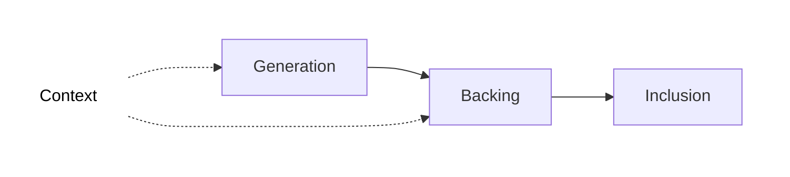
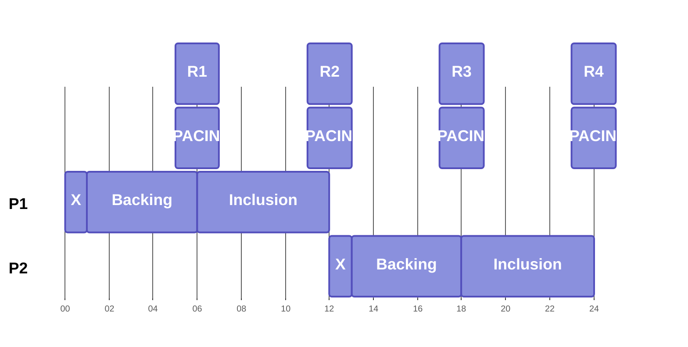
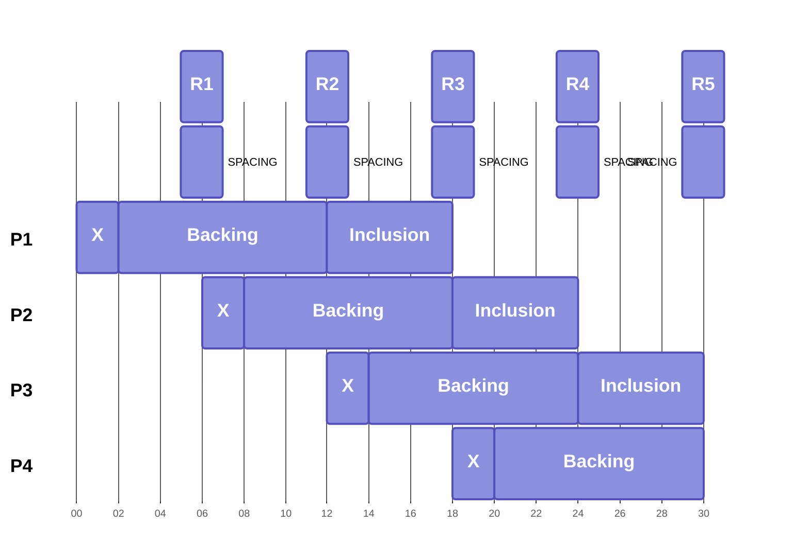

# Asynchronous Backing

## Introduction

Parachain blocks secured by the Polkadot relay chain are processed through a mulit-step pipeline called the [Inclusion Pipeline](#inclusion-pipeline).

Asynchronous backing (often shortened to **_Async Backing_**) decouples the steps of this pipeline which enables parallel processing. Specifically, it allows for the generation and backing steps to kick off for a given parablock *before its parent block completes the pipeline*.

The introduction of this technique improves throughput of the Polkadot network and lays the foundation for many blocks of the same parachain to be processed in parallel via [Elastic Scaling](/reference/parachains/consensus/elastic-scaling){target=\_blank}.

## How Async Backing Works

Before diving into *asynchronous* backing, it is helpful to first review each component of the pipeline.

### Inclusion Pipeline

**Context**: Context of state is provided as input in order for collators and validators to build a parablock during the generation and backing stages, respectively. This context is provided by two sources:

* **Relay Parent**: The relay chain block which a given parablock is anchored to. Note that the relay parent of a parablock and the relay block including that parablock are always different. This context source lives on the relay chain.

* **Unincluded Segments**: Chains of candidate parablocks that have yet to be included in the relay chain, i.e. they can contain parablocks at any stage pre-inclusion. The core functionality that asynchronous backing brings is the ability to build on these unincluded segments of block ancestors rather than building only on ancestors included in the relay chain state. This context source lives on the collators.

**Generation**: Collators *execute* their blockchain's core functionality to generate a new block, producing a [candidate receipt](), which is passed to validators selected for backing.

**Backing**: A subset of active validators verify if the parablock follows the state transition rules of the parachain and sign *Proof of Validity* (PoV) statements that can have a positive or negative outcome. With enough positive statements, the block is backed and included in the relay chain, but is still pending approval.

**Inclusion**: Validators gossip [erasure code chunks]() and put the parablock through the final [approval process]() before a parablock is considered *included* in the relay chain.

### Sync VS. Async

In the synchronous scenario, both the collators and validators draw context from the Relay Parent of the prior parablock, which lives on the relay chain. This makes the Backing and Generation steps tightly coupled to the prior parablock completing the inclusion pipeline. As a result, one parablock can be processed every other relay blocks.

In the asynchronous scenario, where both the collators and validators have access to Unincluded Segments as an additional context source, the Backing and Generation steps are no longer coupled to the prior block completing the full inclusion pipeline. Instead, the prior parablock only needs to complete the generation step and be added to the Unincluded Segments before the next parablock can begin the Backing and Generation steps.

This results in one parablock being processed *every* relay block, and allows for more time to execute during the Generation step (0.5s --> 2s).

### Compute Advantage
Below is a table showing the main advantages of asynchronous over synchronous backing.

|                                      | Sync Backing | Async Backing | Async Backing Advantage                   |
| ------------------------------------ | ------------ | ------------  | ----------------------------------------- |
| **Parablocks included every**        | 12 seconds   | 6 seconds     | **2x** more parablocks included           |
| **Parablock maximum execution time** | 0.5 seconds  | 2 seconds     | **4x** more execution time in a parablock |
| **Total Computer Gain (per core)**   |              |               | **8x Compute Throughput**                 |

## Configurations
The following configurations can be set by onchain governance:

* [`max_candidate_depth`](https://github.com/paritytech/polkadot-sdk/blob/f204e3264f945c33b4cea18a49f7232c180b07c5/polkadot/primitives/src/vstaging/mod.rs#L49): the number of parachain blocks a collator can produce that are not yet included in the relay chain.
* [`allowed_ancestry_len`](https://github.com/paritytech/polkadot-sdk/blob/f204e3264f945c33b4cea18a49f7232c180b07c5/polkadot/primitives/src/vstaging/mod.rs#L54): the oldest relay chain parent a parachain block can be built on top of.