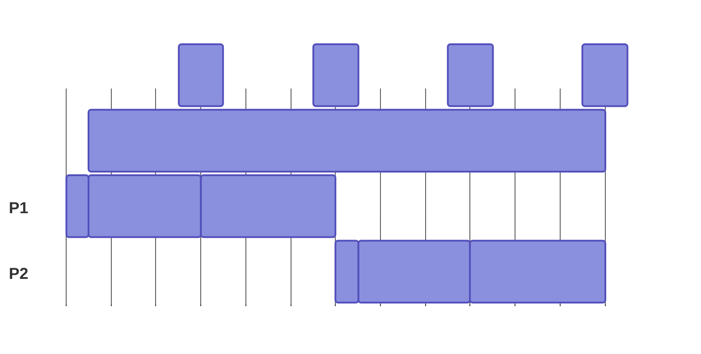
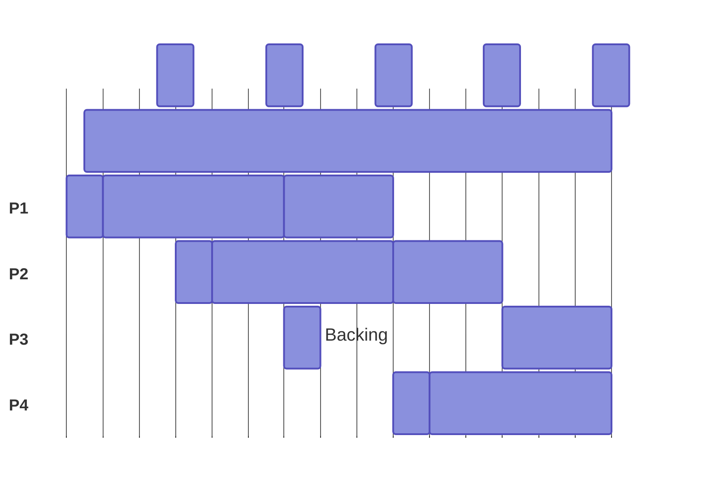

# Asynchronous Backing

## Introduction

Asynchronous backing often shortened to _Async Backing_ is a parachain protocol feature that significantly improves performance, enabling parachains to produce blocks twice as fast (every 6 seconds instead of every 12) and to provide 4x more execution time per block (2 seconds instead of 0.5). 

Technically, async backing is a parachain [configuration](https://paritytech.github.io/polkadot-sdk/master/cumulus_primitives_core/relay_chain/struct.AsyncBackingParams.html){target=\_blank} that allows collators and validators to build blocks ahead of the relay chain during the generation and backing stages of the [Inclusion Pipeline](/reference/parachains/consensus/inclusion-pipeline){target=\_blank} by using unincluded segments, which are chains of parachain blocks that have not yet been fully included in the relay chain. This decouples parachain block production from relay chain inclusion, improves coretime efficiency, and enables the parallel processing required for parachains to further scale throughput using [Elastic Scaling](/reference/parachains/consensus/elastic-scaling){target=\_blank}.

## Configurations
The following configurations can be set by on-chain governance, dictating how many blocks ahead of the relay chain a given parachain's collators can run:

- [**`max_candidate_depth`**](https://paritytech.github.io/polkadot-sdk/master/cumulus_primitives_core/relay_chain/struct.AsyncBackingParams.html#structfield.max_candidate_depth){target=\_blank}: the number of parablocks a collator can produce that are not yet included in the relay chain. A value of `2` means that there can be a maximum of 3 unincluded parablocks at any given time.
- [**`allowed_ancestry_len`**](https://paritytech.github.io/polkadot-sdk/master/cumulus_primitives_core/relay_chain/struct.AsyncBackingParams.html#structfield.allowed_ancestry_len){target=\_blank}: the oldest relay parent a parablock can be built on top of. A value of `1` means collators can start building blocks 6 seconds in advance.

## Synchronous VS. Asynchronous Processing

The Polkadot-parachain protocol originally operated in synchronous mode, where both collators and validators drew context exclusively from the relay parent of the prior parablock, which lives on the relay chain. This made the Backing and Generation steps tightly coupled to the prior parablock completing the entire inclusion pipeline. As a result, one parablock could only be processed every other relay block, with just 0.5 seconds assigned for execution.

The modern protocol now uses asynchronous backing, where both collators and validators have access to [unincluded segments](/reference/parachains/consensus/inclusion-pipeline){target=\_blank} as an additional context source. The Backing and Generation steps are no longer coupled to the prior block completing the full inclusion pipeline. Instead, the prior parablock only needs to complete the generation step and be added to the Unincluded Segments before the next parablock can begin the Backing and Generation steps.

This results in one parablock being processed every relay block (instead of every other relay block), and allows for more time to execute during the Generation step (0.5s → 2s).

