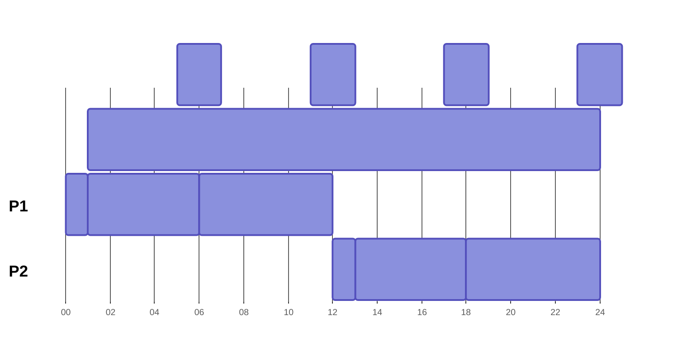
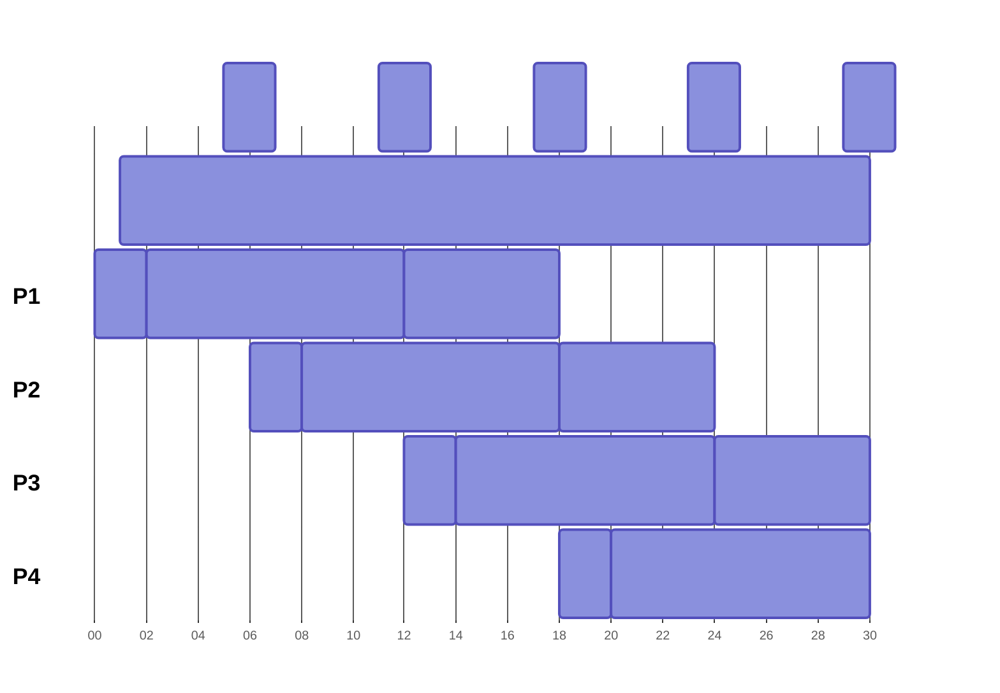

Asynchronous backing (often shortened to ***Async Backing***) is a parachain [configuration](https://github.com/paritytech/polkadot-sdk/blob/f204e3264f945c33b4cea18a49f7232c180b07c5/polkadot/primitives/src/vstaging/mod.rs#L43) set by on-chain governance. It allows collators and validators to build *some* number of blocks ahead of the relay chain during the **generation** and **backing** stages of the [Inclusion Pipeline](/reference/parachains/consensus/inclusion-pipeline).

Async Backing improves throughput of the overall Polkadot Network by using coretime more efficiently, and enables the parallel processing needed for parachains to further scale throughput via [Elastic Scaling](/reference/parachains/consensus/elastic-scaling).

## Configurations
The following configurations can be set by on-chain governance, dictating how many blocks ahead of the relay chain a given parachain's collators can run:

* [`max_candidate_depth`](https://github.com/paritytech/polkadot-sdk/blob/f204e3264f945c33b4cea18a49f7232c180b07c5/polkadot/primitives/src/vstaging/mod.rs#L49): the number of parablocks a collator can produce that are not yet included in the relay chain. A value of `2` means that there can be a maximum of 3 unincluded parablocks at any given time.
* [`allowed_ancestry_len`](https://github.com/paritytech/polkadot-sdk/blob/f204e3264f945c33b4cea18a49f7232c180b07c5/polkadot/primitives/src/vstaging/mod.rs#L54): the oldest relay parent a parablock can be built on top of. A value of `1` means collators can start building blocks 6 seconds in advance.

## Synchronous VS. Asynchronous Processing

<!-- In the synchronous scenario, both the collators and validators draw context from the relay parent of the prior parablock, which lives on the relay chain. This makes the Backing and Generation steps tightly coupled to the prior parablock completing the inclusion pipeline. As a result, one parablock can be processed *every other* relay block, and only `0.5` seconds are assigned for execution. -->

The Polkadot-parachain protocol originally operated in synchronous mode, where both collators and validators drew context exclusively from the relay parent of the prior parablock, which lives on the relay chain. This made the Backing and Generation steps tightly coupled to the prior parablock completing the entire inclusion pipeline. As a result, one parablock could only be processed every other relay block, with just 0.5 seconds assigned for execution.



<!-- In the asynchronous scenario, where both the collators and validators have access to [Unincluded Segments](/reference/parachains/consensus/inclusion-pipeline) as an additional context source, the Backing and Generation steps are no longer coupled to the prior block completing the full inclusion pipeline. Instead, the prior parablock only needs to complete the generation step and be added to the Unincluded Segments before the next parablock can begin the Backing and Generation steps.

This results in one parablock being processed *every* relay block, and allows for `2` seconds of execution. -->

The modern protocol now uses asynchronous backing, where both collators and validators have access to [Unincluded Segments](/reference/parachains/consensus/inclusion-pipeline) as an additional context source. The Backing and Generation steps are no longer coupled to the prior block completing the full inclusion pipeline. Instead, the prior parablock only needs to complete the generation step and be added to the Unincluded Segments before the next parablock can begin the Backing and Generation steps.

This results in one parablock being processed every relay block (instead of every other relay block), and allows for more time to execute during the Generation step (0.5s → 2s).



<!-- In the multi-core scenario, by using elastic scaling we can further increase the the number of parablocks processed for each relay block. By using two cores, here we double the number of parablocks being processed in a 30 second period:

```mermaid
---
    displayMode: compact
    config:
        themeCSS: "
            #item1 { fill: #450693; stroke: #450693; } \n
            #item2 { fill: #8C00FF; stroke: #8C00FF; } \n
            #item3 { fill: #FFC400; stroke: #FFC400; } \n
            #r { fill: #eb4172; stroke: none; } \n
            #p1padTop { display: none; } \n
            text.taskText[id^=p1padTop] { fill: none !important; color: #000 !important; } \n


            /* Default inside task text: white */ \n
            .taskText { fill: #fff !important; color: #fff !important; font-weight: 700; font-size: 18px; } \n

            /* Hide text inside bars */
            .taskText { display: none !important; } \n

            /* Outside labels and section titles: black */ \n
            .taskTextOutside, .sectionTitle { fill: #000 !important; color: #000 !important; font-weight: 700; font-size: 18px; } \n

            /* Inside text for #r items: black */ \n
            text.taskText[id^=r] { fill: #fff !important; } \n
        "
        themeVariables:
            sectionBkgColor: '#fff'
        gantt:
            numberSectionStyles: 1
            barHeight: 70
            gridLineStartPadding: 100
---
%%{init: {"gantt": {"barHeight": 70 }}}%%
gantt
    dateFormat YYYY
    axisFormat %y
    %% this next line doesn't recognise 'decade' or 'year', but will silently ignore
    tickInterval '10year'

    section F1
    R1 : r, 1905, 1907
    R2 : r, 1911, 1913
    R3 : r, 1917, 1919
    R4 : r, 1923, 1925
    R5 : r, 1929, 1931

    section F2
    SPACING : p1padTop, 1901, 1930

    section P1
    X   :            item1, 1900, 1902
    Backing   :            item2, 1902, 1912
    Inclusion   :            item3, 1912, 1918

    section P2
    X   :            item1, 1906, 1908
    Backing   :            item2, 1908, 1918
    Inclusion   :            item3, 1918, 1924
    
    section P3
    X   :            item1, 1912, 1914
    Backing   :            item2, 1914, 1924
    Inclusion   :            item3, 1924, 1930

    section F20
    SPACING : p1padTop, 1901, 1930

    section F21
    R1 : r, 1905, 1907
    R2 : r, 1911, 1913
    R3 : r, 1917, 1919
    R4 : r, 1923, 1925
    R5 : r, 1929, 1931

    section F22
    SPACING : p1padTop, 1901, 1930


    section P4
    X   :            item1, 1900, 1902
    Backing   :            item2, 1902, 1912
    Inclusion   :            item3, 1912, 1918

    section P5
    X   :            item1, 1906, 1908
    Backing   :            item2, 1908, 1918
    Inclusion   :            item3, 1918, 1924
    
    section P6
    X   :            item1, 1912, 1914
    Backing   :            item2, 1914, 1924
    Inclusion   :            item3, 1924, 1930
``` -->