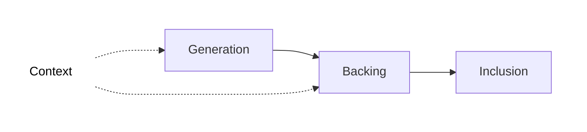

# Inclusion Pipeline

## Introduction

The inclusion pipeline is the multi-stage process through which every parachain block (parablock) is validated and secured before being finalized in the Polkadot relay chain.

This pipeline ensures that all parablocks meet Polkadot's security guarantees through progressive verification. Each one passes through multiple validation stages with different validator sets, preventing invalid parablocks from being finalized even if some validators or collators are malicious/compromised.

By configuring [Async Backing](/reference/parachains/consensus/async-backing){target=\_blank}, a parachain can run this pipeline in parallel for many blocks, enabling high throughput.

## Pipeline Stages

The inclusion pipeline consists of three main stages:

### Context

To build a parablock during the generation and backing stages, collators and validators require access to the state context of the parachain. This context is derived from two sources:

  - **Relay Parent**: The relay chain block to which the parablock is anchored. Note that the relay parent of a parablock is always different from the relay chain block that eventually includes it. This context source resides on the relay chain.

  - **Unincluded Segments**: Chains of candidate parablocks that have not yet been included in the relay chain. These segments represent sequences of block ancestors and may contain candidates at any stage pre-inclusion. A key feature enabled by [Async Backing](/reference/parachains/consensus/async-backing){target=\_blank} is that collators can build new parablocks on top of these unincluded ancestors rather than being limited to ancestors already included in the relay chain state. This context source resides on the collators.

### Generation

Collators execute their blockchain core functionality to generate a new block, producing a [proof-of-validity](https://paritytech.github.io/polkadot-sdk/book/types/availability.html?#proof-of-validity) (PoV), which is passed to validators selected for backing. The PoV is composed of:

  - A list of state transitions called the **block candidate**
  - The values in the parachain's database that the block modifies
  - The hashes of the unaffected points in the Merkle tree

### Backing 

A subset of active validators verify that the parablock follows the state transition rules of the parachain and sign a [validity statement](https://paritytech.github.io/polkadot-sdk/book/types/backing.html?#validity-attestation) about the PoV which can have a positive or negative outcome. With enough positive statements (at least 2/3 of assigned validators), the candidate is considered backable. It is then noted in a fork on the relay chain, at which point it is considered backed, ready for the next stage of the pipeline.

### Inclusion

 Validators gossip [erasure code chunks](https://paritytech.github.io/polkadot-sdk/book/types/availability.html#erasure-chunk) and put the parablock through the final [approval process](https://paritytech.github.io/polkadot-sdk/book/protocol-approval.html) before it is considered *included* in the relay chain.