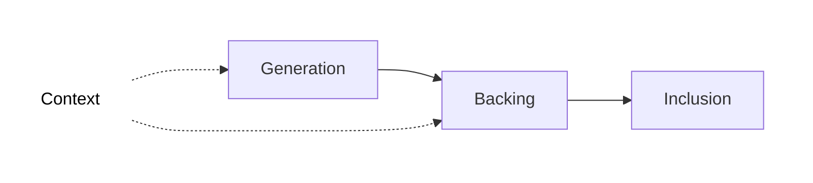

The inclusion pipeline is the multi-stage process through which every parachain block (parablock) is **validated** and **secured** before being finalized in the Polkadot relay chain.

This pipeline ensures that all parablocks meet Polkadot's security guarantees through progressive verification: each parablock passes through multiple validation stages with different validator sets, ensuring that invalid parablocks cannot be finalized even if some validators *or collators* are malicious/compromised.

By configuring [Async Backing](/reference/parachains/consensus/async-backing), a parachin can run this pipeline in parallel for many blocks, allowing for high throughput.

## Pipeline Stages

The inclusion pipeline consists of three main stages:

**Context**: Context of state is provided as input in order for collators and validators to build a parablock during the generation and backing stages, respectively. This context is provided by two sources:

* **Relay Parent**: The relay chain block which a given parablock is anchored to. Note that the relay parent of a parablock and the relay block including that parablock are always different. This context source lives on the relay chain.

* **Unincluded Segments**: Chains of candidate parablocks that have yet to be included in the relay chain, i.e. they can contain blocks at any stage pre-inclusion. The core functionality that [Async Backing](/reference/parachains/consensus/async-backing) brings is the ability to build on these unincluded segments of block ancestors rather than building only on ancestors included in the relay chain state. This context source lives on the collators.

**Generation**: Collators *execute* their blockchain's core functionality to generate a new block, producing a [proof-of-validity](https://paritytech.github.io/polkadot-sdk/book/types/availability.html?#proof-of-validity) (PoV), which is passed to validators selected for backing. The PoV is composed of:

- The block candidate (list of state transitions)
- The values in the parachain's database that the block modifies
- The hashes of the unaffected points in the Merkle tree

**Backing**: A subset of active validators verify that the parablock follows the state transition rules of the parachain and sign a [validity statement](https://paritytech.github.io/polkadot-sdk/book/types/backing.html?#validity-attestation) about the PoV which can have a positive or negative outcome. With enough positive statements, the block is backed and noted on the relay chain, but is still pending approval.

**Inclusion**: Validators gossip [erasure code chunks](https://paritytech.github.io/polkadot-sdk/book/types/availability.html#erasure-chunk) and put the parablock through the final [approval process](https://paritytech.github.io/polkadot-sdk/book/protocol-approval.html) before it is considered *included* in the relay chain.