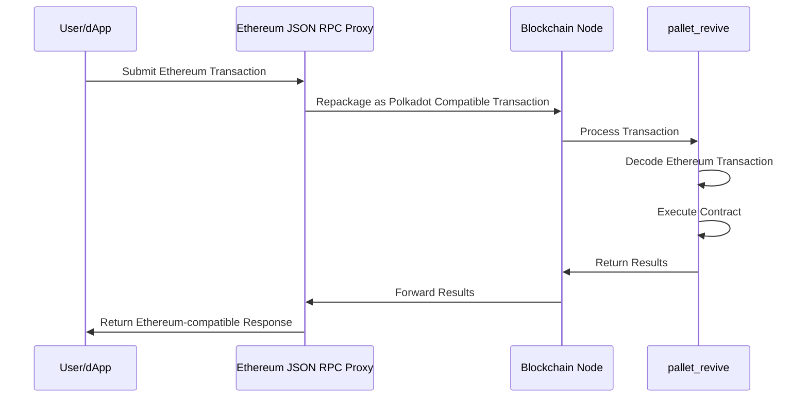

# Dual Virtual Machine Stack

## Introduction

Polkadot's smart contract platform supports two distinct virtual machine (VM) architectures, providing developers with flexibility in selecting the optimal execution backend for their specific needs. This approach strikes a balance between immediate Ethereum compatibility and long-term innovation, enabling developers to deploy either unmodified (Ethereum Virtual Machine) EVM contracts using Rust Ethereum Virtual Machine (REVM) or optimize for higher performance using PolkaVM (PVM).

Both VM options share common infrastructure, including RPC interfaces, tooling support, and precompiles. The following sections compare architectures and guide you in selecting the best VM for your project's needs.

## REVM Backend

The [REVM backend](https://github.com/bluealloy/revm){target=\_blank} is a complete Rust implementation of the Ethereum Virtual Machine, enabling Solidity contracts to run unchanged on Polkadot Hub.

### Key Benefits

- **Zero modifications required**: Deploy existing Ethereum contracts exactly as they are.
- **Full EVM compatibility**: Exact EVM behavior for audit tools and bytecode inspection.
- **Familiar tooling**: Use Hardhat, Foundry, Remix, and all standard Ethereum development tools.
- **Rapid deployment**: Get your contracts running on Polkadot immediately.
- **Established infrastructure**: Work with the Ethereum tooling ecosystem you already know.

### How It Works

REVM enables Ethereum developers to seamlessly migrate to Polkadot, achieving improved performance and lower fees without modifying their existing contracts or development workflows.

## Architecture

### Revive Pallet

[**`pallet_revive`**](https://paritytech.github.io/polkadot-sdk/master/pallet_revive/index.html){target=\_blank} is the runtime module that executes smart contracts. It processes Ethereum-style transactions through the following workflow:

This proxy-based approach eliminates the need for node binary modifications, maintaining compatibility across different client implementations. Preserving the original Ethereum transaction payload simplifies the adaptation of existing tools, which can continue processing familiar transaction formats.

## Alternative: PVM Backend

For advanced use cases requiring maximum performance, Polkadot Hub also supports the [PVM (Polkadot Virtual Machine)](https://github.com/paritytech/polkavm){target=\_blank} backend. PVM uses a RISC-V-based architecture that can provide performance optimizations for computationally intensive workloads. Solidity contracts can be compiled to PVM bytecode using the `resolc` compiler.

Most developers should start with REVM for its simplicity and full Ethereum compatibility. PVM is available for projects with specific performance requirements.

## Where To Go Next

-   Learn __Contract Deployment__

    ---

    Understand deployment mechanics, gas estimation behavior, and storage considerations.

    [:octicons-arrow-right-24: Reference](/smart-contracts/for-eth-devs/contract-deployment/)

-   Learn __Smart Contracts on Polkadot Hub__

    ---

    Learn about smart contracts on Polkadot Hub, including REVM and PVM.

    [:octicons-arrow-right-24: Reference](/reference/polkadot-hub/smart-contracts/)

