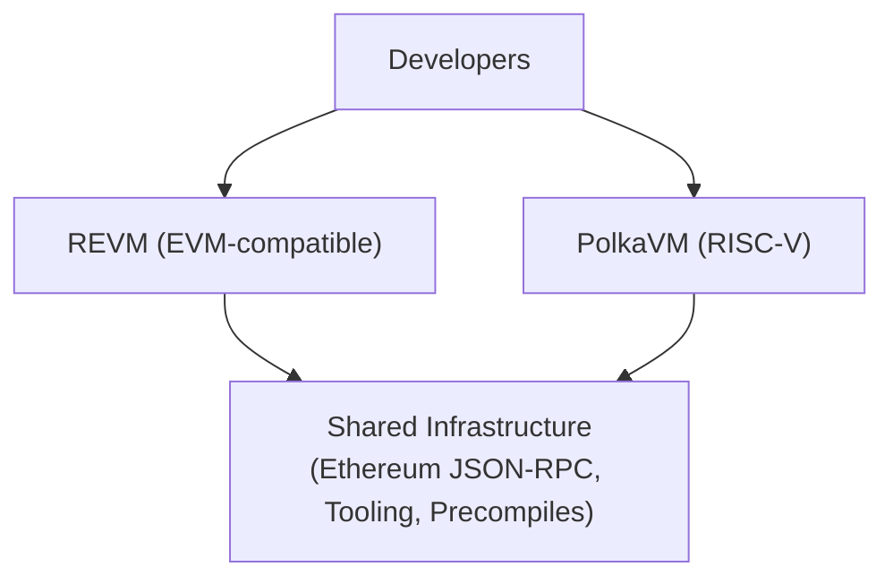

# Dual Virtual Machine Stack

## Introduction

Polkadot's smart contract platform provides developers with a unique dual virtual machine architecture, offering flexibility in choosing the right execution backend for their needs. This approach balances immediate Ethereum compatibility with long-term innovation, allowing developers to deploy either unmodified EVM contracts or optimize for higher performance using PVM.

The dual-stack architecture consists of:

- **[REVM Backend](#revm-backend){target=\_blank}**: Provides full Ethereum Virtual Machine compatibility, enabling unchanged Solidity contracts and familiar tooling
- **[PolkaVM Backend](#polkavm-backend){target=\_blank}**: A RISC-V-based virtual machine optimized for performance and enabling new use cases

Both backends share common infrastructure including RPC interfaces, tooling support, and precompiles, ensuring consistent developer experience while offering distinct performance characteristics.

## REVM Backend

The [REVM backend](https://github.com/bluealloy/revm){target=\_blank} integrates a complete Rust implementation of the Ethereum Virtual Machine, enabling Solidity contracts to run unchanged on Polkadot's smart contract platform.

This allows developers to use their existing Ethereum tooling and infrastructure to build on Polkadot.

The REVM backend is ideal for:

- Quick migration: Projects porting existing Ethereum dApps without code modifications
- Established tooling: Teams leveraging mature Ethereum development infrastructure
- Third-party integrations: Applications requiring standard EVM bytecode inspection
- Compatibility requirements: Contracts needing exact EVM behavior for audited code

## PolkaVM Backend

[PolkaVM](https://github.com/paritytech/polkavm){target=\_blank} represents a next-generation virtual machine built on [RISC-V](https://en.wikipedia.org/wiki/RISC-V){target=\_blank} architecture, optimized for high-performance smart contract execution while maintaining Solidity compatibility through the Revive compiler.

### Core PVM concepts

- **Architecture**: Register-based RISC-V VM with native 64-bit words. Solidity is supported via Revive/LLVM, offering lower overhead than the EVM's stack-based, 256-bit design.
- **Resources (pricing)**: Dimensions like `ref_time` (compute), `proof_size` (state proof), `storage_deposit` (state bloat) are mapped to a single gas number at the RPC layer.
- **Execution**: Interpreter at the time of writing; JIT planned for heavy workloads. Lazy interpretation avoids upfront compilation cost.
- **Deployment**: Two-step flow. First upload code, and then instantiate by code hash. On-chain constructors replace runtime code generation (no dynamic codegen).
- **Limits**: Fixed caps (stack depth, event topics/data, storage value size, transient/immutable vars, code size) for predictable nesting and capacity planning.
- **Tooling/bytecode**: Ethereum JSON-RPC and common tooling work. PVM bytecode is RISC-V (EVM bytecode inspectors won't parse); limited `EXTCODECOPY`.
- **Calls and safety**: Cross-contract calls forward resource limits automatically. Use explicit reentrancy guards; do not rely on gas stipends. Pricing is benchmark-based, making compute cheaper relative to I/O.

## Choosing the Right Backend

The dual-stack architecture allows developers to select the optimal backend based on their specific requirements:

- Choose REVM when:

    - Migrating existing Ethereum contracts without modifications
    - Requiring exact EVM behavior for audited code
    - Using tools that inspect EVM bytecode
    - Prioritizing rapid deployment over optimization
    - Working with established Ethereum infrastructure

- Choose PolkaVM when:

    - Building performance-critical applications
    - Requiring intensive computation
    - Optimizing for lower execution costs

The dual-stack architecture ensures developers have the flexibility to optimize for their specific use case while maintaining access to Polkadot's advanced capabilities through shared infrastructure and precompiles.