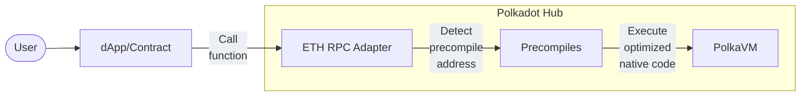

# Advanced Functionalities via Precompiles

--8<-- 'text/smart-contracts/polkaVM-warning.md'

## Introduction

Precompiles serve a dual purpose in the Polkadot ecosystem: they not only enable high-performance smart contracts by providing native, optimized implementations of frequently used functions but will also eventually act as critical bridges, allowing contracts to interact with core platform capabilities.

This article explores how Polkadot leverages precompiles within the Revive pallet to enhance efficiency and how they will extend functionality for developers in the future, including planned access to native features like Cross-Consensus Messaging (XCM).

## What are Precompiles?

Precompiles are special contract implementations that run directly at the runtime level rather than as on-chain PolkaVM contracts. In typical EVM environments, precompiles provide essential cryptographic and utility functionality at addresses that start with specific patterns. Revive follows this design pattern but with its own implementation optimized for PolkaVM.

Users interact with the dApp/Contract, which in turn calls the PolkaEVM. The PolkaEVM detects the precompile address and calls the corresponding precompile. The precompile executes the native code and returns the result to the dApp/Contract. The dApp/Contract then returns the result to the user.

## Conclusion

For smart contract developers, precompiles offer a powerful way to access both low-level, high-performance operations and core platform capabilities within the smart contract execution context. Through Revive, Polkadot exposes these native functionalities, allowing developers to build faster, more efficient contracts that can take full advantage of the Polkadot ecosystem.

Understanding and utilizing precompiles can unlock advanced functionality and performance gains, making them an essential tool for anyone building on the Polkadot Hub.