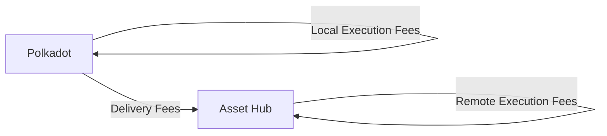

# XCM Fee Estimation

## Introduction

When sending cross-chain messages, you need to make sure that the transaction will be succesful not only in the local chain but also in the destination, or even in the intermediate chains.

Sending cross-chain messages requires estimating the fees for the operation. 

This tutorial will demonstrate how to dry-run and estimate the fees for teleporting assets between the Polkadot relay chain and the Asset Hub parachain.

## Prerequisites

## Fee Mechanism

There are 3 types of fees that can be charged when sending a cross-chain message:

- **Local execution fees** - fees charged in the local chain for executing the message
- **Delivery fees** - fees charged for delivering the message to the destination chain
- **Remote execution fees** - fees charged in the destination chain for executing the message

If there are multiple intermediate chains, the delivery fees and remote execution fees will be charged for each intermediate chain.

In this example, we will estimate the fees for teleporting assets from the Polkadot relay chain to the Asset Hub parachain. The fee structure will be as follows:



The overall fees are `local_execution_fees` + `delivery_fees` + `remote_execution_fees`.

## Environment Setup

First, you need to set up your environment:

1. Create a new directory and initialize project:

    ```bash
    mkdir xcm-fee-estimation && cd xcm-fee-estimation && \
    npm init -y
    ```

2. Install dev dependencies

    ```bash
    npm install --save-dev @types/node@^22.12.0 ts-node@^10.9.2 typescript@^5.7.3
    ```

3. Install dependencies

    ```bash
    npm install --save @polkadot-labs/hdkd@^0.0.13 @polkadot-labs/hdkd-helpers@^0.0.13 polkadot-api@1.9.5
    ```

4. Create TypeScript configuration

    ```bash
    npx tsc --init
    ```

5. Generate the types for the Polkadot API for Polkadot and Asset Hub:

    ```bash
    npx papi add polkadot -n polkadot  &&\
    npx papi add polkadotAssetHub -n polkadot_asset_hub
    ```

6. Create a new file called `teleport.ts`:

    ```bash
    touch teleport.ts
    ```

## Implementation

Now you are ready to implement the fee estimation for the teleport you want to perform.

1. Import the necessary modules. Add the following code to the `teleport.ts` file:

    ```typescript
    import { polkadot, polkadotAssetHub } from "@polkadot-api/descriptors";
    import { createClient } from "polkadot-api";
    import { getWsProvider } from "polkadot-api/ws-provider/node";
    import { withPolkadotSdkCompat } from "polkadot-api/polkadot-sdk-compat";
    import {
    PolkadotRuntimeOriginCaller,
    XcmVersionedLocation,
    XcmVersionedAssets,
    XcmV3Junction,
    XcmV3Junctions,
    XcmV3WeightLimit,
    XcmV3MultiassetFungibility,
    XcmV3MultiassetAssetId,
    } from "@polkadot-api/descriptors";
    import { DispatchRawOrigin } from "@polkadot-api/descriptors";
    import { Binary } from "polkadot-api";
    import { ss58Decode, ss58Encode } from "@polkadot-labs/hdkd-helpers";
    import { sr25519CreateDerive } from "@polkadot-labs/hdkd";
    import { getPolkadotSigner } from "polkadot-api/signer";
    ```

2. Define a main function where you will implement the teleport logic:

    ```typescript
    // Imports

    async function main() {
    // Code
    }
    ```

3. The first step is to create the Polkadot API clients. You will need to create two clients, one for the Polkadot relay chain and one for the Asset Hub parachain. Add the following code to the `main` function:

    ```typescript
    // Imports

    async function main() {
        // Connect to the Polkadot relay chain
        const polkadotClient = createClient(
            withPolkadotSdkCompat(getWsProvider("ws://localhost:8001"))
        );

        // Connect to the Polkadot Asset Hub parachain
        const polkadotAssetHubClient = createClient(
            withPolkadotSdkCompat(getWsProvider("ws://localhost:8000"))
        );
    }
    ```

    Make sure to replace the `ws://localhost:8001` and `ws://localhost:8000` with the actual WebSocket endpoints of the Polkadot relay chain and the Asset Hub parachain.

    You can find the WebSocket endpoints in here https://github.com/polkadot-js/apps/blob/master/packages/apps-config/src/endpoints/productionRelayPolkadot.ts

4. Create a signer from your mnemonic:

    ```typescript
    // Create a signer from your mnemonic
    const MNEMONIC = "INSERT_YOUR_MNEMONIC";
    const miniSecret = entropyToMiniSecret(mnemonicToEntropy(MNEMONIC));
    const derive = sr25519CreateDerive(miniSecret);
    const accountKeyPair = derive("");
    const accountSigner = getPolkadotSigner(
        accountKeyPair.publicKey,
        "Sr25519",
        accountKeyPair.sign
    );
    ```

    Check other ways to create a signer in the [Polkadot API documentation](https://papi.how/signers){target=\_blank}.