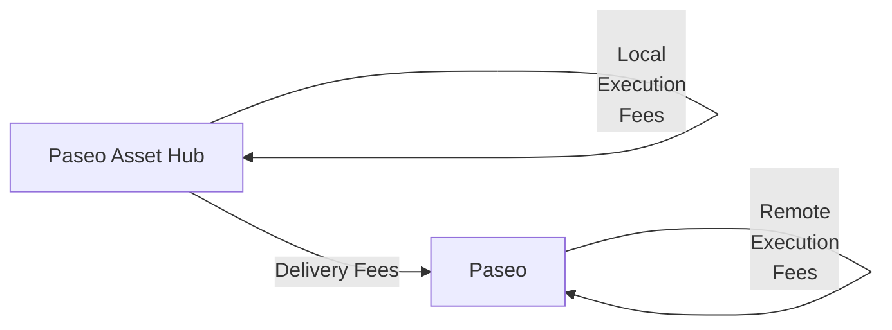

# XCM Fee Estimation

## Introduction

When sending cross-chain messages, you need to make sure that the transaction will be successful not only in the local chain but also in the destination, or even in the intermediate chains.

Sending cross-chain messages requires estimating the fees for the operation. 

This tutorial will demonstrate how to dry-run and estimate the fees for teleporting assets from the Paseo Asset Hub parachain to the Paseo relay chain.

## Fee Mechanism

There are 3 types of fees that can be charged when sending a cross-chain message:

- **Local execution fees**: Fees charged in the local chain for executing the message.
- **Delivery fees**: Fees charged for delivering the message to the destination chain.
- **Remote execution fees**: Fees charged in the destination chain for executing the message.

If there are multiple intermediate chains, the delivery fees and remote execution fees will be charged for each intermediate chain.

In this example, you will estimate the fees for teleporting assets from the Paseo Asset Hub parachain to the Paseo relay chain. The fee structure will be as follows:



The overall fees are `local_execution_fees` + `delivery_fees` + `remote_execution_fees`.

## Environment Setup

First, you need to set up your environment:

1. Create a new directory and initialize the project:

    ```bash
    mkdir xcm-fee-estimation && \
    cd xcm-fee-estimation
    ```

2. Initialize the project:

    ```bash
    npm init -y
    ```

3. Install dev dependencies

    ```bash
    npm install --save-dev @types/node@^22.12.0 ts-node@^10.9.2 typescript@^5.7.3
    ```

4. Install dependencies

    ```bash
    npm install --save @polkadot-labs/hdkd@^0.0.13 @polkadot-labs/hdkd-helpers@^0.0.13 polkadot-api@1.9.5
    ```

5. Create TypeScript configuration

    ```bash
    npx tsc --init
    ```

6. Generate the types for the Polkadot API for Paseo and Paseo Asset Hub:

    ```bash
    npx papi add paseo -n paseo && \
    npx papi add paseoAssetHub -n paseo_asset_hub
    ```

7. Create a new file called `teleport-ah-to-relay.ts`:

    ```bash
    touch teleport-ah-to-relay.ts
    ```

8. Import the necessary modules. Add the following code to the `teleport-ah-to-relay.ts` file:

    ```typescript title="teleport-ah-to-relay.ts"
    --8<-- "code/tutorials/interoperability/xcm-fee-estimation/teleport-ah-to-relay.ts::20"
    ```

9. Define constants and a `main` function where you will implement all the logic:

    ```typescript title="teleport-ah-to-relay.ts"
    --8<-- "code/tutorials/interoperability/xcm-fee-estimation/teleport-ah-to-relay.ts:22:32"

    async function main() {
      // Code will go here
    }

    --8<-- "code/tutorials/interoperability/xcm-fee-estimation/teleport-ah-to-relay.ts:277:277"
    ```

All the following code explained in the subsequent sections must be added inside the `main` function.

## Client and API Setup

Now you are ready to start implementing the logic for the fee estimation for the teleport you want to perform. In this step you will create the client for the Paseo Asset Hub parachain and generate the typed API to interact with the chain. Follow the steps below:

1. Create the API client. You will need to create a client for the Paseo Asset Hub parachain:

    ```typescript title="teleport-ah-to-relay.ts"
    --8<-- "code/tutorials/interoperability/xcm-fee-estimation/teleport-ah-to-relay.ts:234:239"
    ```

    Make sure to replace the endpoint URLs with the actual WebSocket endpoints. This example uses local chopsticks endpoints, but you can use public endpoints or run local nodes.

## Create the XCM Message

Now, you can construct a proper XCM message using the new XCM V5 instructions for teleporting from Asset Hub to the Relay Chain:

```typescript title="teleport-ah-to-relay.ts"
--8<-- "code/tutorials/interoperability/xcm-fee-estimation/teleport-ah-to-relay.ts:34:86"
```

## Fee Estimation Function

Below is a four-step breakdown of the logic needed to estimate the fees for the teleport.

First, you need to create the function that will estimate the fees for the teleport:

```typescript title="teleport-ah-to-relay.ts"
--8<-- "code/tutorials/interoperability/xcm-fee-estimation/teleport-ah-to-relay.ts:88:88"
    // Code will go here
}
```

1. **Local execution fees on Asset Hub**: Compute the XCM weight locally, then convert that weight to PAS using Asset Hub's view of PAS (`parents: 1, interior: Here`). Add the code to the function:

    ```typescript title="teleport-ah-to-relay.ts"
    --8<-- "code/tutorials/interoperability/xcm-fee-estimation/teleport-ah-to-relay.ts:91:116"
    ```

2. **Dry-run and delivery fees to Relay**: Dry-run the XCM on Asset Hub to capture forwarded messages, locate the one targeting Relay (`parents: 1, interior: Here`), and ask for delivery fees. Add the code to the function:

    ```typescript title="teleport-ah-to-relay.ts"
    --8<-- "code/tutorials/interoperability/xcm-fee-estimation/teleport-ah-to-relay.ts:119:171"
    ```

3. **Remote execution fees on Relay**: Connect to Relay, re-compute the forwarded XCM weight there, and convert weight to PAS (`parents: 0, interior: Here`). Add the code to the function:

    ```typescript title="teleport-ah-to-relay.ts"
    --8<-- "code/tutorials/interoperability/xcm-fee-estimation/teleport-ah-to-relay.ts:173:213"
    ```

4. **Sum and return totals**: Aggregate all parts, print a short summary, and return a structured result. Add the code to the function:

    ```typescript title="teleport-ah-to-relay.ts"
    --8<-- "code/tutorials/interoperability/xcm-fee-estimation/teleport-ah-to-relay.ts:215:223"
    ```

The full code for the fee estimation function is the following:

??? code "Fee Estimation Function"

    ```typescript title="teleport-ah-to-relay.ts"
    --8<-- "code/tutorials/interoperability/xcm-fee-estimation/teleport-ah-to-relay.ts:88:231"
    ```

## Complete Implementation

Now put it all together in the main function:

```typescript title="teleport-ah-to-relay.ts"
--8<-- "code/tutorials/interoperability/xcm-fee-estimation/teleport-ah-to-relay.ts:233:275"

```

## Full Code

The full code for the complete implementation is the following:

??? code "Teleport from Asset Hub to Relay"

    ```typescript title="teleport-ah-to-relay.ts"
    --8<-- "code/tutorials/interoperability/xcm-fee-estimation/teleport-ah-to-relay.ts"
    ```

## Running the Script

Before running the script, you can use chopsticks to fork the Paseo Asset Hub and Paseo Relay chains locally. To do so, you can use the following files and commands:

1. Create a new directory called `.chopsticks` and add the files:

    ??? code "paseo.yml"

        ```yaml title=".chopsticks/paseo.yml"
        --8<-- "code/tutorials/interoperability/xcm-fee-estimation/paseo.yml"
        ```
    
    ??? code "paseo-asset-hub.yml"

        ```yaml title=".chopsticks/paseo-asset-hub.yml"
        --8<-- "code/tutorials/interoperability/xcm-fee-estimation/paseo-asset-hub.yml"
        ```

2. Run the following command to fork the Paseo Relay chain:

    ```bash
    chopsticks --config=.chopsticks/paseo.yml
    ```

    After running the command, you will see the following output:

    --8<-- "code/tutorials/interoperability/xcm-fee-estimation/paseo-terminal-output-chopsticks.html"

3. Run the following command to fork the Paseo Asset Hub chain:

    ```bash
    chopsticks --config=.chopsticks/paseo-asset-hub.yml
    ```

    After running the commands, you will see the following output:

    --8<-- "code/tutorials/interoperability/xcm-fee-estimation/paseo-asset-hub-terminal-output-chopsticks.html"

4. Run the script:

    ```bash
    npx ts-node teleport-ah-to-relay.ts
    ```

After running the script, you will see the following output:

--8<-- "code/tutorials/interoperability/xcm-fee-estimation/teleport-output.html"

## Conclusion

This approach provides accurate fee estimation for XCM teleports from Asset Hub to Relay Chain by properly simulating the execution on both chains and using the dedicated runtime APIs for fee calculation. The fee breakdown helps you understand the cost structure of reverse cross-chain operations (parachain → relay chain) and ensures your transactions have sufficient funds to complete successfully.

The key insight is understanding how asset references change based on the perspective of each chain in the XCM ecosystem, which is crucial for proper fee estimation and XCM construction.