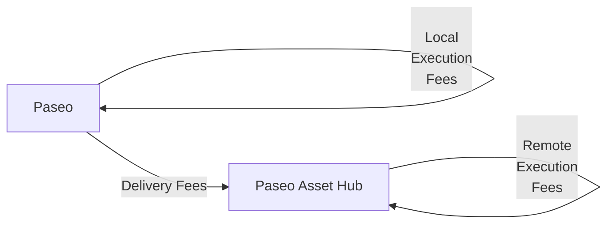

# XCM Fee Estimation

## Introduction

When sending cross-chain messages, you need to make sure that the transaction will be successful not only in the local chain but also in the destination, or even in the intermediate chains.

Sending cross-chain messages requires estimating the fees for the operation. 

This tutorial will demonstrate how to dry-run and estimate the fees for teleporting assets between the Paseo relay chain and the Paseo Asset Hub parachain.

## Fee Mechanism

There are 3 types of fees that can be charged when sending a cross-chain message:

- **Local execution fees**: Fees charged in the local chain for executing the message.
- **Delivery fees**: Fees charged for delivering the message to the destination chain.
- **Remote execution fees**: Fees charged in the destination chain for executing the message.

If there are multiple intermediate chains, the delivery fees and remote execution fees will be charged for each intermediate chain.

In this example, we will estimate the fees for teleporting assets from the Paseo relay chain to the Paseo Asset Hub parachain. The fee structure will be as follows:



The overall fees are `local_execution_fees` + `delivery_fees` + `remote_execution_fees`.

## Environment Setup

First, you need to set up your environment:

1. Create a new directory and initialize the project:

    ```bash
    mkdir xcm-fee-estimation && \
    cd xcm-fee-estimation
    ```

2. Initialize the project:

    ```bash
    npm init -y
    ```

3. Install dev dependencies

    ```bash
    npm install --save-dev @types/node@^22.12.0 ts-node@^10.9.2 typescript@^5.7.3
    ```

4. Install dependencies

    ```bash
    npm install --save @polkadot-labs/hdkd@^0.0.13 @polkadot-labs/hdkd-helpers@^0.0.13 polkadot-api@1.9.5
    ```

5. Create TypeScript configuration

    ```bash
    npx tsc --init
    ```

6. Generate the types for the Polkadot API for Paseo and Paseo Asset Hub:

    ```bash
    npx papi add paseo -n paseo && \
    npx papi add paseoAssetHub -n paseo_asset_hub
    ```

7. Create a new file called `teleport.ts`:

    ```bash
    touch teleport.ts
    ```

8. Import the necessary modules. Add the following code to the `teleport.ts` file:

    ```typescript
    import { paseo, paseoAssetHub } from "@polkadot-api/descriptors";
    import { createClient, Binary, FixedSizeBinary, Enum, type Transaction } from "polkadot-api";
    import { getWsProvider } from "polkadot-api/ws-provider/node";
    import { withPolkadotSdkCompat } from "polkadot-api/polkadot-sdk-compat";
    import {
      XcmVersionedLocation,
      XcmVersionedAssets,
      XcmVersionedAssetId,
      XcmV3Junction,
      XcmV3Junctions,
      XcmV3WeightLimit,
      XcmV3MultiassetFungibility,
      XcmVersionedXcm,
      XcmV4Instruction,
      XcmV4AssetAssetFilter,
      XcmV4AssetWildAsset,
    } from "@polkadot-api/descriptors";
    import {
      ss58Decode,
    } from "@polkadot-labs/hdkd-helpers";
    ```

9. Define constants and a `main` function where you will implement all the logic:

    ```typescript
    const PAS_UNITS = 10_000_000_000n;
    const PAS_CENTS = 100_000_000n;

    // Paseo Relay Chain constants
    const PASEO_RPC_ENDPOINT = "ws://localhost:8000";
    const PASEO_ACCOUNT = "15oF4uVJwmo4TdGW7VfQxNLavjCXviqxT9S1MgbjMNHr6Sp5"; // Alice

    // Paseo Asset Hub constants
    const PASEO_ASSET_HUB_RPC_ENDPOINT = "ws://localhost:8001";
    const PASEO_ASSET_HUB_PARA_ID = 1000;
    const ASSET_HUB_ACCOUNT = "16D2eVuK5SWfwvtFD3gVdBC2nc2BafK31BY6PrbZHBAGew7L"; // Bob

    async function main() {
      // Code will go here
    }

    main().catch(console.error);
    ```

All the following code explained in the subsequent sections must be added inside the `main` function.

## Client and API Setup

Now you are ready to start implementing the logic for the fee estimation for the teleport you want to perform. In this step you will create the clients for the Paseo relay chain and the Paseo Asset Hub parachain and generate the typed apis to interact with the chains. Follow the steps below:

1. Create the API clients. You will need to create two clients, one for the Paseo relay chain and one for the Paseo Asset Hub parachain:

    ```typescript
    // Connect to the Paseo relay chain
    const paseoClient = createClient(
      withPolkadotSdkCompat(getWsProvider(PASEO_RPC_ENDPOINT))
    );

    // Get the typed API for Paseo
    const paseoApi = paseoClient.getTypedApi(paseo);
    ```

    Make sure to replace the endpoint URLs with the actual WebSocket endpoints. You can use public endpoints or run local nodes.

## Create the XCM Message

Instead of using the `limited_teleport_assets` extrinsic, we'll construct a proper XCM message and use `XcmPallet.execute`. This gives us more control and follows best practices:

```typescript
// Helper function to create XCM for teleport to Asset Hub
function createTeleportXcm(receiverAddress: string, amount: bigint, paraId: number) {
  const receiverPublicKey = ss58Decode(receiverAddress)[0];
  const beneficiary = {
    parents: 0,
    interior: XcmV3Junctions.X1(
      XcmV3Junction.AccountId32({
        network: undefined,
        id: FixedSizeBinary.fromBytes(receiverPublicKey),
      })
    ),
  };
  
  return XcmVersionedXcm.V4([
    // Withdraw PAS from account on Paseo relay chain
    XcmV4Instruction.WithdrawAsset([
      {
        id: { parents: 0, interior: XcmV3Junctions.Here() },
        fun: XcmV3MultiassetFungibility.Fungible(amount),
      },
    ]),
    // Use PAS to pay for local execution fees
    XcmV4Instruction.BuyExecution({
      fees: {
        id: { parents: 0, interior: XcmV3Junctions.Here() },
        fun: XcmV3MultiassetFungibility.Fungible(10n * PAS_CENTS),
      },
      weight_limit: XcmV3WeightLimit.Unlimited(),
    }),
    // Teleport the PAS to Asset Hub
    XcmV4Instruction.InitiateTeleport({
      assets: XcmV4AssetAssetFilter.Wild(XcmV4AssetWildAsset.AllCounted(1)),
      dest: {
        parents: 0,
        interior: XcmV3Junctions.X1(XcmV3Junction.Parachain(paraId)),
      },
      xcm: [
        // Pay fees with PAS on Asset Hub (now it's parents: 1 from Asset Hub perspective)
        XcmV4Instruction.BuyExecution({
          fees: {
            id: { parents: 1, interior: XcmV3Junctions.Here() },
            fun: XcmV3MultiassetFungibility.Fungible(10n * PAS_CENTS),
          },
          weight_limit: XcmV3WeightLimit.Unlimited(),
        }),
        // Deposit all assets to beneficiary
        XcmV4Instruction.DepositAsset({
          assets: XcmV4AssetAssetFilter.Wild(XcmV4AssetWildAsset.AllCounted(1)),
          beneficiary,
        }),
      ],
    }),
  ]);
}
```

## Fee Estimation Function

Create a comprehensive function to estimate all fees:

```typescript
async function estimateXcmFees(xcm: any, paseoApi: any) {
  console.log('=== Fee Estimation Process ===');
  
  // 1. LOCAL EXECUTION FEES
  console.log('1. Calculating local execution fees...');
  let localExecutionFees = 0n;
  
  const weightResult = await paseoApi.apis.XcmPaymentApi.query_xcm_weight(xcm);
  if (weightResult.success) {
    console.log('✓ XCM weight calculated:', weightResult.value);
    
    // Convert weight to fee amount using PAS (parents: 0, interior: Here on Paseo)
    const executionFeesResult = await paseoApi.apis.XcmPaymentApi.query_weight_to_asset_fee(
      weightResult.value,
      XcmVersionedAssetId.V4({
        parents: 0,
        interior: XcmV3Junctions.Here(),
      }),
    );
    
    if (executionFeesResult.success) {
      localExecutionFees = executionFeesResult.value;
      console.log('✓ Local execution fees:', localExecutionFees.toString(), 'PAS units');
    } else {
      console.log('✗ Failed to calculate execution fees:', executionFeesResult.value);
    }
  } else {
    console.log('✗ Failed to query XCM weight:', weightResult.value);
  }

  // 2. DELIVERY FEES + REMOTE EXECUTION FEES
  console.log('\n2. Calculating delivery and remote execution fees...');
  let deliveryFees = 0n;
  let remoteExecutionFees = 0n;

  // Origin is from Paseo relay chain perspective
  const origin = XcmVersionedLocation.V4({
    parents: 0,
    interior: XcmV3Junctions.X1(
      XcmV3Junction.AccountId32({
        id: FixedSizeBinary.fromAccountId32(PASEO_ACCOUNT),
        network: undefined,
      })
    ),
  });

  // Dry run the XCM locally on Paseo
  const dryRunResult = await paseoApi.apis.DryRunApi.dry_run_xcm(origin, xcm);
  
  if (dryRunResult.success && dryRunResult.value.execution_result.type === 'Complete') {
    console.log('✓ Local dry run successful');
    
    const { forwarded_xcms: forwardedXcms } = dryRunResult.value;
    
    // Find the XCM message sent to Asset Hub
    const assetHubXcmEntry = forwardedXcms.find(([location, _]: [any, any]) => (
      (location.type === 'V4' || location.type === 'V5') &&
      location.value.parents === 0 &&
      location.value.interior.type === 'X1' &&
      location.value.interior.value.type === 'Parachain' &&
      location.value.interior.value.value === PASEO_ASSET_HUB_PARA_ID
    ));

    if (assetHubXcmEntry) {
      const [destination, messages] = assetHubXcmEntry;
      const remoteXcm = messages[0];
      
      console.log('✓ Found XCM message to Asset Hub');

      // Calculate delivery fees
      const deliveryFeesResult = await paseoApi.apis.XcmPaymentApi.query_delivery_fees(
        destination,
        remoteXcm
      );
      
      if (deliveryFeesResult.success && 
          deliveryFeesResult.value.type === 'V4' && 
          deliveryFeesResult.value.value[0]?.fun?.type === 'Fungible') {
        deliveryFees = deliveryFeesResult.value.value[0].fun.value;
        console.log('✓ Delivery fees:', deliveryFees.toString(), 'PAS units');
      } else {
        console.log('✗ Failed to calculate delivery fees:', deliveryFeesResult);
      }

      // Calculate remote execution fees on Asset Hub
      console.log('\n3. Calculating remote execution fees on Asset Hub...');
      try {
        const assetHubClient = createClient(
          withPolkadotSdkCompat(getWsProvider(PASEO_ASSET_HUB_RPC_ENDPOINT))
        );
        const assetHubApi = assetHubClient.getTypedApi(paseoAssetHub);

        // Query weight of the remote XCM on Asset Hub
        const remoteWeightResult = await assetHubApi.apis.XcmPaymentApi.query_xcm_weight(remoteXcm);
        
        if (remoteWeightResult.success) {
          console.log('✓ Remote XCM weight calculated:', remoteWeightResult.value);
          
          // Convert to fee using PAS (parents: 1, interior: Here from Asset Hub perspective)
          const remoteFeesResult = await assetHubApi.apis.XcmPaymentApi.query_weight_to_asset_fee(
            remoteWeightResult.value,
            XcmVersionedAssetId.V4({
              parents: 1,
              interior: XcmV3Junctions.Here(),
            }),
          );
          
          if (remoteFeesResult.success) {
            remoteExecutionFees = remoteFeesResult.value;
            console.log('✓ Remote execution fees:', remoteExecutionFees.toString(), 'PAS units');
          } else {
            console.log('✗ Failed to calculate remote execution fees:', remoteFeesResult.value);
          }
        } else {
          console.log('✗ Failed to query remote XCM weight:', remoteWeightResult.value);
        }

        assetHubClient.destroy();
      } catch (error) {
        console.error('Error calculating remote execution fees:', error);
      }
    } else {
      console.log('✗ No XCM message found to Asset Hub');
    }
  } else {
    console.log('✗ Local dry run failed:', dryRunResult.value);
  }

  // 4. TOTAL FEES
  const totalFees = localExecutionFees + deliveryFees + remoteExecutionFees;
  
  console.log('\n=== Fee Summary ===');
  console.log('Local execution fees:', localExecutionFees.toString(), 'PAS units');
  console.log('Delivery fees:', deliveryFees.toString(), 'PAS units');
  console.log('Remote execution fees:', remoteExecutionFees.toString(), 'PAS units');
  console.log('TOTAL FEES:', totalFees.toString(), 'PAS units');
  console.log('TOTAL FEES:', (Number(totalFees) / Number(PAS_UNITS)).toFixed(4), 'PAS');
  
  return {
    localExecutionFees,
    deliveryFees,
    remoteExecutionFees,
    totalFees
  };
}
```

## Complete Implementation

Now put it all together in the main function:

```typescript
async function main() {
  // Connect to the Paseo relay chain
  const paseoClient = createClient(
    withPolkadotSdkCompat(getWsProvider(PASEO_RPC_ENDPOINT))
  );

  // Get the typed API for Paseo
  const paseoApi = paseoClient.getTypedApi(paseo);

  try {
    const amountToTransfer = 12n * PAS_UNITS; // 12 PAS

    // Create the XCM message for teleport
    const xcm = createTeleportXcm(ASSET_HUB_ACCOUNT, amountToTransfer, PASEO_ASSET_HUB_PARA_ID);

    console.log('=== XCM Teleport: Paseo → Paseo Asset Hub ===');
    console.log('From:', PASEO_ACCOUNT, '(Alice)');
    console.log('To:', ASSET_HUB_ACCOUNT, '(Bob)');
    console.log('Amount:', (Number(amountToTransfer) / Number(PAS_UNITS)).toString(), 'PAS');
    console.log('');

    // Estimate all fees
    const fees = await estimateXcmFees(xcm, paseoApi);

    // Create the execute transaction
    const tx = paseoApi.tx.XcmPallet.execute({
      message: xcm,
      max_weight: {
        ref_time: 6000000000n, // 6 billion ref_time units
        proof_size: 65536n,    // 64KB proof size
      },
    });

    console.log('\n=== Transaction Details ===');
    console.log('Transaction hex:', (await tx.getEncodedData()).asHex());
    console.log('Ready to submit!');

    // Optional: Submit the transaction with a signer
    // const signer = ... // Create your signer
    // const result = await tx.signAndSubmit(signer);
    // console.log('Transaction submitted:', result);

  } catch (error) {
    console.error("Error occurred:", (error as Error).message);
    if ((error as Error).cause) {
      console.dir((error as Error).cause, { depth: null });
    }
  } finally {
    // Ensure client is always destroyed
    paseoClient.destroy();
  }
}
```

## Key Differences from Previous Approach

This updated approach:

1. **Uses Paseo testnet** instead of Polkadot mainnet for easier testing
2. **Constructs proper XCM messages** with `WithdrawAsset`, `BuyExecution`, and `InitiateTeleport` instructions
3. **Uses `XcmPallet.execute`** instead of `limited_teleport_assets` for better control
4. **Properly handles asset perspectives** - PAS is `parents: 0, interior: Here` on Paseo but `parents: 1, interior: Here` on Asset Hub
5. **Uses `dry_run_xcm`** to simulate XCM execution and extract forwarded messages
6. **Estimates all three fee components** systematically using the proper runtime APIs

## Running the Script

To run the script:

1. Make sure you have Paseo and Paseo Asset Hub nodes running (or use public endpoints)
2. Update the RPC endpoints in the constants
3. Run: `npx ts-node teleport.ts`

The script will output detailed fee calculations and prepare the transaction for submission.

## Conclusion

This approach provides accurate fee estimation for XCM teleports by properly simulating the execution on both chains and using the dedicated runtime APIs for fee calculation. The fee breakdown helps you understand the cost structure of cross-chain operations and ensures your transactions have sufficient funds to complete successfully.