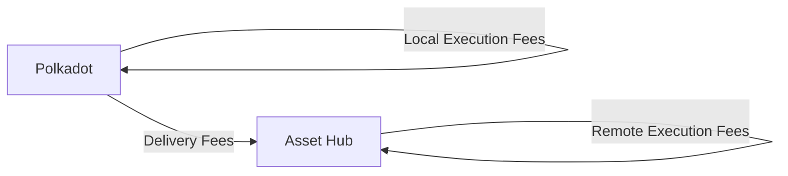

# XCM Fee Estimation

## Introduction

When sending cross-chain messages, you need to make sure that the transaction will be succesful not only in the local chain but also in the destination, or even in the intermediate chains.

Sending cross-chain messages requires estimating the fees for the operation. 

This tutorial will demonstrate how to dry-run and estimate the fees for teleporting assets between the Polkadot relay chain and the Asset Hub parachain.

## Prerequisites

## Fee Mechanism

There are 3 types of fees that can be charged when sending a cross-chain message:

- **Local execution fees** - fees charged in the local chain for executing the message
- **Delivery fees** - fees charged for delivering the message to the destination chain
- **Remote execution fees** - fees charged in the destination chain for executing the message

If there are multiple intermediate chains, the delivery fees and remote execution fees will be charged for each intermediate chain.

In this example, we will estimate the fees for teleporting assets from the Polkadot relay chain to the Asset Hub parachain. The fee structure will be as follows:



The overall fees are `local_execution_fees` + `delivery_fees` + `remote_execution_fees`.

## Environment Setup

First, you need to set up your environment:

1. Create a new directory and initialize the project:

    ```bash
    mkdir xcm-fee-estimation && \
    cd xcm-fee-estimation && \
    npm init -y
    ```

2. Install dev dependencies

    ```bash
    npm install --save-dev @types/node@^22.12.0 ts-node@^10.9.2 typescript@^5.7.3
    ```

3. Install dependencies

    ```bash
    npm install --save @polkadot-labs/hdkd@^0.0.13 @polkadot-labs/hdkd-helpers@^0.0.13 polkadot-api@1.9.5
    ```

4. Create TypeScript configuration

    ```bash
    npx tsc --init
    ```

5. Generate the types for the Polkadot API for Polkadot and Asset Hub:

    ```bash
    npx papi add polkadot -n polkadot && \
    npx papi add polkadotAssetHub -n polkadot_asset_hub
    ```

6. Create a new file called `teleport.ts`:

    ```bash
    touch teleport.ts
    ```

7. Import the necessary modules. Add the following code to the `teleport.ts` file:

    ```typescript
    --8<-- 'code/tutorials/interoperability/xcm-runtime-api/teleport.ts::24'
    ```

8. Define a `main` function where you will implement all the logic:

    ```typescript
    // Imports

    --8<-- 'code/tutorials/interoperability/xcm-runtime-api/teleport.ts:26:26'
      // Code
    }

    main().catch(console.error);
    ```

All the following code explained in the subsequent sections must be added inside the `main` function.

## Client and API Setup

Now you are ready to start implementing the logic for the fee estimation for the teleport you want to perform. In this step you will create the clients for the Polkadot relay chain and the Asset Hub parachain and generate the typed apis to interact with the chains. Follow the steps below:

1. Create the API clients. You will need to create two clients, one for the Polkadot relay chain and one for the Asset Hub parachain:

    ```typescript
    --8<-- 'code/tutorials/interoperability/xcm-runtime-api/teleport.ts:27:39'
    ```

    Make sure to replace the `INSERT_POLKADOT_WS_URL` and `INSERT_ASSET_HUB_WS_URL` with the actual WebSocket endpoints of the Polkadot relay chain and the Asset Hub parachain.

    You can find available WebSocket endpoints in the [Polkadot.js Apps repository](https://github.com/polkadot-js/apps/blob/master/packages/apps-config/src/endpoints/productionRelayPolkadot.ts){target=\_blank}

2. Generate the typed APIs for both chains:

    ```typescript
    --8<-- 'code/tutorials/interoperability/xcm-runtime-api/teleport.ts:41:44'
    ```

## Create a Signer

To be able to submit the transaction after estimating the fees, you need to create a signer. In this example, you will create a signer from a mnemonic. You can check other ways to create a signer in the [Polkadot API documentation](https://papi.how/signers){target=\_blank}. Add the following code:

```typescript
// Create a signer from your mnemonic
const MNEMONIC = "INSERT_YOUR_MNEMONIC";
const miniSecret = entropyToMiniSecret(mnemonicToEntropy(MNEMONIC));
const derive = sr25519CreateDerive(miniSecret);
const accountKeyPair = derive("");
const accountSigner = getPolkadotSigner(
    accountKeyPair.publicKey,
    "Sr25519",
    accountKeyPair.sign
);
```

Make sure to replace the `INSERT_YOUR_MNEMONIC` with your actual 12-word mnemonic.

!!! warning
    Keep your mnemonic safe and never share it with anyone. If it is compromised, your funds can be stolen.

## Estimate the Fees

After setting up your project and creating the necessary clients and signer, you can start estimating the fees for the teleport. In this step, you will estimate the local execution fees, delivery fees, and remote execution fees. 

You will start by defining a `try-catch-finally` block to ensure that you handle any errors and clean up the clients. Add the following code:

```typescript
try {
    // Code
} catch (error) {
    console.error("Error occurred:", error.message);
    if (error.cause) {
      console.dir(error.cause, { depth: null });
    }
  } finally {
    // Ensure clients are always destroyed
    polkadotClient.destroy();
    polkadotAssetHubClient.destroy();
  }
```

The following sections will be added inside the `try` block.

### Create the Teleport Extrinsic

!!! warning
    TODO Replace with XCM execute when PayFees instruction is live.

For now just use the limited_teleport_assets extrinsic:

```typescript
// Define the parameters for the transaction
const senderAddress = "15oF4uVJwmo4TdGW7VfQxNLavjCXviqxT9S1MgbjMNHr6Sp5"; // Alice's address
const receiverAddress = "16D2eVuK5SWfwvtFD3gVdBC2nc2BafK31BY6PrbZHBAGew7L"; // Bob's address
const amountToTransfer = 120000000000n; // 12 DOT
const polkadotAssetHubParaId = 1000;

// Define the origin caller
let origin = PolkadotRuntimeOriginCaller.system(
    DispatchRawOrigin.Signed(senderAddress)
);

// Construct the id of the receiver
const receiverPublicKey = ss58Decode(receiverAddress)[0];
const idBeneficiary = Binary.fromBytes(receiverPublicKey);

// Define a transaction to transfer assets from Polkadot to Polkadot Asset Hub using a Teleport Transfer
const tx = polkadotApi.tx.XcmPallet.limited_teleport_assets({
    dest: XcmVersionedLocation.V3({
    parents: 0,
    interior: XcmV3Junctions.X1(
        XcmV3Junction.Parachain(polkadotAssetHubParaId) // Destination is the Polkadot Asset Hub parachain
    ),
    }),
    beneficiary: XcmVersionedLocation.V3({
    parents: 0,
    interior: XcmV3Junctions.X1(
        XcmV3Junction.AccountId32({
        // Beneficiary address on Polkadot Asset Hub
        network: undefined,
        id: idBeneficiary,
        })
    ),
    }),
    assets: XcmVersionedAssets.V3([
    {
        id: XcmV3MultiassetAssetId.Concrete({
        parents: 0,
        interior: XcmV3Junctions.Here(), // Asset from the sender's location
        }),
        fun: XcmV3MultiassetFungibility.Fungible(amountToTransfer), // Asset amount to transfer
    },
    ]),
    fee_asset_item: 0, // Asset used to pay transaction fees, 0 means the same asset as the one being transferred
    weight_limit: XcmV3WeightLimit.Unlimited(), // No weight limit on transaction
});
```

### Local Execution Fees

To estimate the local execution fees, first you will perform a dry-run of the transaction on the Polkadot relay chain using the [`dry_run_call`](/develop/interoperability/xcm-runtime-apis/#dry-run-call){target=\_blank} runtime API:

1. Execute a dry-run of the transaction on the Polkadot relay chain:

    ```typescript
    // Execute the dry run call to simulate the transaction
    const dryRunResult = await polkadotApi.apis.DryRunApi.dry_run_call(
      origin,
      tx.decodedCall
    );

    if (!dryRunResult.success) {
      const error = new Error("Dry run failed");
      error.cause = dryRunResult.value;
      throw error;
    }
    ```

2. If the dry-run is successful, you can extract the results from the call. Here you will get the the result of executing the extrinsic, the list of events fired by the extrinsic, the local XCM that was attempted to be executed, if any and the list of XCMs that were queued for sending to Asset Hub:

    ```typescript
    // Extract the results from the dry run call
    const { execution_result, emitted_events, local_xcm, forwarded_xcms } =
      dryRunResult.value;

    // Extract the XCMs generated by this call
    const xcmsToAssetHub = forwarded_xcms.find(
      ([location, _]) =>
        location.type === "V4" &&
        location.value.parents === 0 &&
        location.value.interior.type === "X1" &&
        location.value.interior.value.type === "Parachain" &&
        location.value.interior.value.value === polkadotAssetHubParaId
    );

    // Extract the destination and remote XCM from the XCMs generated
    const destination = xcmsToAssetHub[0];
    const remoteXcm = xcmsToAssetHub[1][0];
    ```

    

3. Query the weight weight required to execute the obtained XCM message by calling the [`query_xcm_weight`](/develop/interoperability/xcm-runtime-apis/#query-xcm-weight){target=\_blank} runtime API:

    ```typescript
    // Execute the query weight runtime call for the local XCM
    const localWeightResult =
      await polkadotApi.apis.XcmPaymentApi.query_xcm_weight(
        dryRunResult.value.local_xcm
      );

    if (!localWeightResult.success) {
      const error = new Error("Query weight for local xcm failed");
      error.cause = localWeightResult.value;
      throw error;
    }
    ```

4. Finally, convert the weight to fees for the local XCM by calling the [`query_weight_to_asset_fee`](/develop/interoperability/xcm-runtime-apis/#query-weight-to-asset-fee){target=\_blank} runtime API:
   
    ```typescript
   // Convert the weight to fees for the local XCM
    const localExecutionFeesResult =
      await polkadotApi.apis.XcmPaymentApi.query_weight_to_asset_fee(
        localWeightResult.value,
        {
          type: "V4",
          value: { parents: 0, interior: { type: "Here", value: undefined } },
        }
      );

    if (!localExecutionFeesResult.success) {
      const error = new Error("Query weight to asset fee for local xcm failed");
      error.cause = localExecutionFeesResult.value;
      throw error;
    }

    const localExecutionFees = localExecutionFeesResult.value;
    ```

### Delivery Fees

Using the `destination` and `remoteXcm` obtained from the dry-run in the previous step, you can estimate the delivery fees by calling the [`query_delivery_fees`](/develop/interoperability/xcm-runtime-apis/#query-delivery-fees){target=\_blank} runtime API:

```typescript
// Execute the query delivery fees runtime call
const deliveryFeesResult =
    await polkadotApi.apis.XcmPaymentApi.query_delivery_fees(
    destination,
    remoteXcm
    );

if (!deliveryFeesResult.success) {
    const error = new Error("Query delivery fees for remote xcm failed");
    error.cause = deliveryFeesResult.value;
    throw error;
}

const assets = deliveryFeesResult.value;
const deliveryFees =
    (assets.type === "V4" &&
    assets.value[0].fun.type === "Fungible" &&
    assets.value[0].fun.value.valueOf()) ||
    0n;
```

### Remote Execution Fees

Finally, you can dry-run the remote XCM on the Asset Hub parachain to estimate the remote execution fees. You will use the `remoteXcm` obtained from the local dry-run in the first step:

1. Query the weight required to execute the remote XCM by calling the [`query_xcm_weight`](/develop/interoperability/xcm-runtime-apis/#query-xcm-weight){target=\_blank} runtime API:

    ```typescript
    // Execute the query weight runtime call for the remote XCM
    const remoteWeightResult =
      await polkadotAssetHubApi.apis.XcmPaymentApi.query_xcm_weight(remoteXcm);

    if (!remoteWeightResult.success) {
      const error = new Error("Query weight for remote xcm failed");
      error.cause = remoteWeightResult.value;
      throw error;
    }
    ```

2. Convert the weight to fees for the remote XCM by calling the [`query_weight_to_asset_fee`](/develop/interoperability/xcm-runtime-apis/#query-weight-to-asset-fee){target=\_blank} runtime API:

    ```typescript
    // Convert the weight to fees for the remote XCM
    const remoteExecutionFeesResult =
      await polkadotAssetHubApi.apis.XcmPaymentApi.query_weight_to_asset_fee(
        remoteWeightResult.value,
        {
          type: "V4",
          value: { parents: 1, interior: { type: "Here", value: undefined } },
        }
      );

    if (!remoteExecutionFeesResult.success) {
      const error = new Error(
        "Query weight to asset fee for remote xcm failed"
      );
      error.cause = remoteExecutionFeesResult.value;
      throw error;
    }

    const remoteExecutionFees = remoteExecutionFeesResult.value;
    ```

### Submit the Extrinsic

After estimating all the fees for the teleport ... TODO

!!! warning
    TODO Replace the value in PayFess instruction with the fees calculated in the previous steps.


```typescript
// const newTx = polkadotApi.tx.XcmPallet ...
// let txResult = await newTx.signAndSubmit(accountSigner);
```

## Conclusion