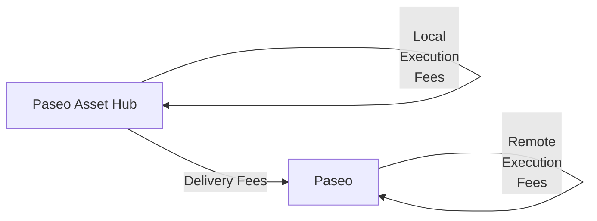

# XCM Fee Estimation

## Introduction

When sending cross-chain messages, you need to make sure that the transaction will be successful not only in the local chain but also in the destination, or even in the intermediate chains.

Sending cross-chain messages requires estimating the fees for the operation. 

This tutorial will demonstrate how to dry-run and estimate the fees for teleporting assets from the Paseo Asset Hub parachain to the Paseo relay chain.

## Fee Mechanism

There are 3 types of fees that can be charged when sending a cross-chain message:

- **Local execution fees**: Fees charged in the local chain for executing the message.
- **Delivery fees**: Fees charged for delivering the message to the destination chain.
- **Remote execution fees**: Fees charged in the destination chain for executing the message.

If there are multiple intermediate chains, the delivery fees and remote execution fees will be charged for each intermediate chain.

In this example, we will estimate the fees for teleporting assets from the Paseo Asset Hub parachain to the Paseo relay chain. The fee structure will be as follows:



The overall fees are `local_execution_fees` + `delivery_fees` + `remote_execution_fees`.

## Environment Setup

First, you need to set up your environment:

1. Create a new directory and initialize the project:

    ```bash
    mkdir xcm-fee-estimation && \
    cd xcm-fee-estimation
    ```

2. Initialize the project:

    ```bash
    npm init -y
    ```

3. Install dev dependencies

    ```bash
    npm install --save-dev @types/node@^22.12.0 ts-node@^10.9.2 typescript@^5.7.3
    ```

4. Install dependencies

    ```bash
    npm install --save @polkadot-labs/hdkd@^0.0.13 @polkadot-labs/hdkd-helpers@^0.0.13 polkadot-api@1.9.5
    ```

5. Create TypeScript configuration

    ```bash
    npx tsc --init
    ```

6. Generate the types for the Polkadot API for Paseo and Paseo Asset Hub:

    ```bash
    npx papi add paseo -n paseo && \
    npx papi add paseoAssetHub -n paseo_asset_hub
    ```

7. Create a new file called `teleport-ah-to-relay.ts`:

    ```bash
    touch teleport-ah-to-relay.ts
    ```

8. Import the necessary modules. Add the following code to the `teleport-ah-to-relay.ts` file:

    ```typescript title="teleport-ah-to-relay.ts"
    import { DispatchRawOrigin, paseo, paseoAssetHub } from "@polkadot-api/descriptors";
    import {
      createClient,
      FixedSizeBinary,
      Enum,
    } from "polkadot-api";
    import { getWsProvider } from "polkadot-api/ws-provider/node";
    import { withPolkadotSdkCompat } from "polkadot-api/polkadot-sdk-compat";
    import {
      XcmVersionedLocation,
      XcmVersionedAssetId,
      XcmV3Junctions,
      XcmV3MultiassetFungibility,
      XcmVersionedXcm,
      XcmV5Instruction,
      XcmV5Junctions,
      XcmV5Junction,
      XcmV5AssetFilter,
      XcmV5WildAsset,
    } from "@polkadot-api/descriptors";
    ```

9. Define constants and a `main` function where you will implement all the logic:

    ```typescript title="teleport-ah-to-relay.ts"
    // 1 PAS = 10^10 units
    const PAS_UNITS = 10_000_000_000n; // 1 PAS
    const PAS_CENTS = 100_000_000n; // 0.01 PAS

    // Paseo Relay Chain constants
    const PASEO_RPC_ENDPOINT = "ws://localhost:8000";
    const PASEO_ACCOUNT = "15oF4uVJwmo4TdGW7VfQxNLavjCXviqxT9S1MgbjMNHr6Sp5"; // Alice (Paseo Relay Chain)

    // Paseo Asset Hub constants
    const PASEO_ASSET_HUB_RPC_ENDPOINT = "ws://localhost:8001";
    const PASEO_ASSET_HUB_PARA_ID = 1000;
    const ASSET_HUB_ACCOUNT = "14E5nqKAp3oAJcmzgZhUD2RcptBeUBScxKHgJKU4HPNcKVf3"; // Bob (Paseo Asset Hub)

    async function main() {
      // Code will go here
    }

    main().catch(console.error);
    ```

All the following code explained in the subsequent sections must be added inside the `main` function.

## Client and API Setup

Now you are ready to start implementing the logic for the fee estimation for the teleport you want to perform. In this step you will create the client for the Paseo Asset Hub parachain and generate the typed API to interact with the chain. Follow the steps below:

1. Create the API client. You will need to create a client for the Paseo Asset Hub parachain:

    ```typescript title="teleport-ah-to-relay.ts"
    // Connect to the Asset Hub parachain
    const assetHubClient = createClient(
      withPolkadotSdkCompat(getWsProvider(PASEO_ASSET_HUB_RPC_ENDPOINT))
    );

    // Get the typed API for Asset Hub
    const assetHubApi = assetHubClient.getTypedApi(paseoAssetHub);
    ```

    Make sure to replace the endpoint URLs with the actual WebSocket endpoints. You can use public endpoints or run local nodes.

## Create the XCM Message

We'll construct a proper XCM message using the new XCM V5 instructions for teleporting from Asset Hub to the Relay Chain. The key difference here is that from the Asset Hub's perspective, PAS tokens are represented as `parents: 1, interior: Here` since they originate from the relay chain:

```typescript title="teleport-ah-to-relay.ts"
// Helper function to create XCM for teleport to Relay (Asset Hub → Relay)
function createTeleportXcmToRelay() {
  return XcmVersionedXcm.V5([
    // Withdraw PAS from Asset Hub (PAS on parachains is parents:1, interior: Here)
    XcmV5Instruction.WithdrawAsset([
      {
        id: { parents: 1, interior: XcmV5Junctions.Here() },
        fun: XcmV3MultiassetFungibility.Fungible(1n * PAS_UNITS), // 1 PAS
      },
    ]),
    // Pay local fees on Asset Hub in PAS
    XcmV5Instruction.PayFees({
      asset: {
        id: { parents: 1, interior: XcmV5Junctions.Here() },
        fun: XcmV3MultiassetFungibility.Fungible(10n * PAS_CENTS), // 0.1 PAS
      },
    }),
    // Send to Relay (parents:1, interior: Here)
    XcmV5Instruction.InitiateTransfer({
      destination: {
        parents: 1,
        interior: XcmV5Junctions.Here(),
      },
      remote_fees: Enum(
        "Teleport",
        XcmV5AssetFilter.Definite([
          {
            id: { parents: 1, interior: XcmV5Junctions.Here() },
            fun: XcmV3MultiassetFungibility.Fungible(10n * PAS_CENTS), // 0.1 PAS
          },
        ]),
      ),
      preserve_origin: false,
      remote_xcm: [
        XcmV5Instruction.DepositAsset({
          assets: XcmV5AssetFilter.Wild(XcmV5WildAsset.AllCounted(1)),
          beneficiary: {
            parents: 0,
            interior: XcmV5Junctions.X1(
              XcmV5Junction.AccountId32({
                network: undefined,
                id: FixedSizeBinary.fromAccountId32(PASEO_ACCOUNT),
              })
            ),
          },
        }),
      ],
      assets: [
        Enum("Teleport", XcmV5AssetFilter.Wild(XcmV5WildAsset.AllCounted(1))), // We send everything.
      ],
    }),
  ]);
}
```

## Fee Estimation Function

Below is a four-step breakdown of the logic that lives inside `estimateXcmFeesFromAssetHub(xcm, assetHubApi)` in `teleport-ah-to-relay.ts`.

```typescript title="teleport-ah-to-relay.ts"
async function estimateXcmFeesFromAssetHub(xcm: XcmVersionedXcm, assetHubApi: ApiPromise) {
  // Code will go here
}
```

1. **Local execution fees on Asset Hub**: Compute the XCM weight locally, then convert that weight to PAS using Asset Hub's view of PAS (`parents: 1, interior: Here`).

    ```typescript title="teleport-ah-to-relay.ts"
    // 1) Local execution fees on Asset Hub
    let localExecutionFees = 0n;

    const weightResult = await assetHubApi.apis.XcmPaymentApi.query_xcm_weight(xcm);
    if (weightResult.success) {
    const executionFeesResult = await assetHubApi.apis.XcmPaymentApi.query_weight_to_asset_fee(
        weightResult.value,
        XcmVersionedAssetId.V4({ parents: 1, interior: XcmV3Junctions.Here() })
    );
    if (executionFeesResult.success) {
        localExecutionFees = executionFeesResult.value;
    }
    }
    ```

2. **Dry-run and delivery fees to Relay**: Dry-run the XCM on Asset Hub to capture forwarded messages, locate the one targeting Relay (`parents: 1, interior: Here`), and ask for delivery fees.

```typescript title="teleport-ah-to-relay.ts"
// 2) Delivery fees to Relay (from Asset Hub)
let deliveryFees = 0n;

const origin = XcmVersionedLocation.V5({
  parents: 0,
  interior: XcmV5Junctions.X1(
    XcmV5Junction.AccountId32({ id: FixedSizeBinary.fromAccountId32(ASSET_HUB_ACCOUNT), network: undefined })
  ),
});

const dryRunResult = await assetHubApi.apis.DryRunApi.dry_run_xcm(origin, xcm);
if (dryRunResult.success && dryRunResult.value.execution_result.type === "Complete") {
  const relayXcmEntry = dryRunResult.value.forwarded_xcms.find(
    ([location]: [any, any]) => (location.type === "V4" || location.type === "V5") && location.value.parents === 1 && location.value.interior?.type === "Here"
  );
  if (relayXcmEntry) {
    const [destination, messages] = relayXcmEntry;
    const remoteXcm = messages[0];
    const deliveryFeesResult = await assetHubApi.apis.XcmPaymentApi.query_delivery_fees(destination, remoteXcm);
    if (deliveryFeesResult.success) {
      const v = deliveryFeesResult.value;
      if ((v.type === "V4" || v.type === "V5") && v.value[0]?.fun?.type === "Fungible") {
        deliveryFees = v.value[0].fun.value;
      }
    }
  }
}
```

3. **Remote execution fees on Relay**: Connect to Relay, re-compute the forwarded XCM weight there, and convert weight to PAS (`parents: 0, interior: Here`).

```typescript title="teleport-ah-to-relay.ts"
// 3) Remote execution fees on Relay
let remoteExecutionFees = 0n;

const relayClient = createClient(withPolkadotSdkCompat(getWsProvider(PASEO_RPC_ENDPOINT)));
const relayApi = relayClient.getTypedApi(paseo);

const remoteWeightResult = await relayApi.apis.XcmPaymentApi.query_xcm_weight(remoteXcm);
if (remoteWeightResult.success) {
  const remoteFeesResult = await relayApi.apis.XcmPaymentApi.query_weight_to_asset_fee(
    remoteWeightResult.value,
    XcmVersionedAssetId.V5({ parents: 0, interior: XcmV5Junctions.Here() })
  );
  if (remoteFeesResult.success) {
    remoteExecutionFees = remoteFeesResult.value;
  }
}

relayClient.destroy();
```

4. **Sum and return totals**: Aggregate all parts, print a short summary, and return a structured result.

```typescript title="teleport-ah-to-relay.ts"
// 4) Total fees
const totalFees = localExecutionFees + deliveryFees + remoteExecutionFees;

console.log("Local execution fees:", localExecutionFees.toString(), "PAS units");
console.log("Delivery fees:", deliveryFees.toString(), "PAS units");
console.log("Remote execution fees:", remoteExecutionFees.toString(), "PAS units");
console.log("TOTAL FEES:", totalFees.toString(), "PAS units");

return { localExecutionFees, deliveryFees, remoteExecutionFees, totalFees };
```

Full code:

??? code "Fee Estimation Function"

    ```typescript title="teleport-ah-to-relay.ts"

    ```


## Complete Implementation

Now put it all together in the main function:

```typescript title="teleport-ah-to-relay.ts"
async function main() {
  // Connect to the Asset Hub parachain
  const assetHubClient = createClient(
    withPolkadotSdkCompat(getWsProvider(PASEO_ASSET_HUB_RPC_ENDPOINT))
  );

  // Get the typed API for Asset Hub
  const assetHubApi = assetHubClient.getTypedApi(paseoAssetHub);

  try {
    // Create the XCM message for teleport (Asset Hub → Relay)
    const xcm = createTeleportXcmToRelay();

    console.log("=== XCM Teleport: Paseo Asset Hub → Paseo Relay ===");
    console.log("From:", ASSET_HUB_ACCOUNT, "(Bob)");
    console.log("To:", PASEO_ACCOUNT, "(Alice)");
    console.log("Amount:", "1 PAS");
    console.log("");

    // Estimate all fees
    const fees = await estimateXcmFeesFromAssetHub(xcm, assetHubApi);

    // Create the execute transaction on Asset Hub
    const tx = assetHubApi.tx.PolkadotXcm.execute({
      message: xcm,
      max_weight: {
        ref_time: 6000000000n,
        proof_size: 65536n,
      },
    });

    console.log("\n=== Transaction Details ===");
    console.log("Transaction hex:", (await tx.getEncodedData()).asHex());
    console.log("Ready to submit!");

    // Optional: Submit the transaction with a signer
    // const signer = ... // Create your signer
    // const result = await tx.signAndSubmit(signer);
    // console.log('Transaction submitted:', result);

  } catch (error) {
    console.error("Error occurred:", (error as Error).message);
    if ((error as Error).cause) {
      console.dir((error as Error).cause, { depth: null });
    }
  } finally {
    // Ensure client is always destroyed
    assetHubClient.destroy();
  }
}
```

## Full Code

??? code "Teleport from Asset Hub to Relay"

    ```typescript title="teleport-ah-to-relay.ts"

    ```

## Running the Script

To run the script, run the following command:

```bash
npx ts-node teleport-ah-to-relay.ts
```

The script will output detailed fee calculations and prepare the transaction for submission from Asset Hub to the Relay Chain:

<div id="termynal" data-termynal>
  <span data-ty="input"><span class="file-path"></span>npx ts-node teleport-ah-to-relay.ts</span>
  <pre>
=== XCM Teleport: Paseo Asset Hub → Paseo Relay ===
From: 14E5nqKAp3oAJcmzgZhUD2RcptBeUBScxKHgJKU4HPNcKVf3 (Bob)
To: 15oF4uVJwmo4TdGW7VfQxNLavjCXviqxT9S1MgbjMNHr6Sp5 (Alice)
Amount: 1 PAS

=== Fee Estimation Process (Asset Hub → Relay) ===
1. Calculating local execution fees on Asset Hub...
✓ XCM weight (Asset Hub): { ref_time: 1462082000n, proof_size: 19578n }
✓ Local execution fees (Asset Hub): 97890000 PAS units

1. Calculating delivery and remote execution fees...
✓ Local dry run on Asset Hub successful
✓ Found XCM message to Relay
✓ Delivery fees: 305150000 PAS units

1. Calculating remote execution fees on Relay...
✓ Remote XCM weight (Relay) calculated: { ref_time: 434130000n, proof_size: 10779n }
✓ Remote execution fees: 34442461 PAS units

=== Fee Summary (Asset Hub → Relay) ===
Local execution fees: 97890000 PAS units
Delivery fees: 305150000 PAS units
Remote execution fees: 34442461 PAS units
TOTAL FEES: 437482461 PAS units
TOTAL FEES: 0.0437 PAS

=== Transaction Details ===
Transaction hex: 0x1f03050c00040100000700e40b54023001000002286bee3101000100000401000002286bee000400010204040d01020400010100d43593c715fdd31c61141abd04a99fd6822c8558854ccde39a5684e7a56da27d0700bca0650102000400
Ready to submit!
  </pre>
</div>

## Conclusion

This approach provides accurate fee estimation for XCM teleports from Asset Hub to Relay Chain by properly simulating the execution on both chains and using the dedicated runtime APIs for fee calculation. The fee breakdown helps you understand the cost structure of reverse cross-chain operations (parachain → relay chain) and ensures your transactions have sufficient funds to complete successfully.

The key insight is understanding how asset references change based on the perspective of each chain in the XCM ecosystem, which is crucial for proper fee estimation and XCM construction.