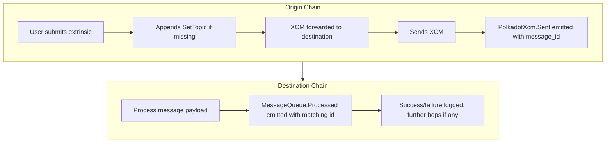

# XCM Observability

## Introduction

Cross-Consensus Messaging (XCM) enables powerful interoperability in the Polkadot ecosystem, but debugging and tracing XCM flows across multiple chains can be challenging.

This guide explains how to **trace, correlate, and debug XCMs** reliably using observability features built into modern Polkadot runtimes and the Polkadot SDK.

You will learn how to:

- Use the `SetTopic` instruction and `message_id` to track XCMs across chains
- Understand the relationship between `PolkadotXcm.Sent` and `MessageQueue.Processed` events for message correlation  
- Apply manual topic tagging for multi-hop tracing when needed
- Use workarounds for older runtimes with derived message IDs
- Debug failed or incomplete XCMs using indexers and Chopsticks replay

The guide revolves around a **single, concrete scenario** of a cross-chain asset transfer/swap between two parachains, with multiple example scripts and detailed outputs.

## Prerequisites

Before you begin, make sure you have:

- [Chopsticks](/develop/toolkit/parachains/fork-chains/chopsticks/get-started/){target=\_blank} installed
- Access to local or remote parachain endpoints
- The origin chain running runtime **`stable2503-5`** or later
- A TypeScript development environment with essential tools
- Familiarity with replaying or dry-running XCMs

If you are new to XCM replay or dry-run, see [Replay and Dry Run XCMs Using Chopsticks](/tutorials/interoperability/replay-and-dry-run-xcms/){target=\_blank}.

## Setting Up Your Workspace

1. Create a project directory:

    ```bash
    mkdir -p xcm-obs-demo && cd xcm-obs-demo
    ```

2. Initialise Node project:

    ```bash
    npm init -y
    ```

3. Install Chopsticks globally:

    ```bash
    npm install -g @acala-network/chopsticks@latest
    ```

4. Install TypeScript and Polkadot dependencies:

    ```bash
    npm install --save-dev typescript @types/node tsx
    npm install polkadot-api @polkadot-labs/hdkd @polkadot-labs/hdkd-helpers
    ```

5. Initialise TypeScript:

    ```bash
    npx tsc --init
    ```

6. Fork the relevant chains locally using Chopsticks:

    ```bash
    npx @acala-network/chopsticks xcm -r polkadot -p polkadot-asset-hub -p hydradx
    ```

   → See the [Fork a Chain with Chopsticks guide](/tutorials/polkadot-sdk/testing/fork-live-chains/){target=\_blank} for detailed instructions.

7. Add descriptors:

    ```bash
    npx papi add assetHub -w ws://localhost:8000
    npx papi add hydration -w ws://localhost:8001
    ```

## Core Concepts

### What is `SetTopic`?

When executing XCMs using `limited_reserve_transfer_assets`, other extrinsics, or raw XCM calls from the `PolkadotXcm` pallet, a `SetTopic` instruction is automatically appended to the end of the message if it is not already present.

- **[`SetTopic([u8; 32])`](https://github.com/polkadot-fellows/xcm-format#settopic){target=\_blank}** is an XCM instruction that sets a 32-byte topic register inside the message.
- The topic acts as a **logical identifier** (`message_id`) for the XCM, allowing you to group and trace related messages across chains.

> ⚠️ **Note:** The topic is **not guaranteed to be unique**. If uniqueness is required (e.g. for deduplication), it must be enforced by the message creator.

### Observability Features

Runtimes built from **`stable2503-5` or later** provide key observability features for tracing and correlating XCMs across chains:

- **[`PolkadotXcm.Sent`](https://paritytech.github.io/polkadot-sdk/master/pallet_xcm/pallet/enum.Event.html#variant.Sent){target=\_blank}** emitted on the origin chain when an XCM is sent.
- **[`MessageQueue.Processed`](https://paritytech.github.io/polkadot-sdk/master/pallet_message_queue/pallet/enum.Event.html#variant.Processed){target=\_blank}** emitted on the destination chain when the XCM is processed.
- The **`message_id` in the `Sent` event matches the `id` in the `Processed` event**, enabling reliable cross-chain correlation. This `message_id` is derived from the `SetTopic` instruction.

| Chain Role        | Event                    | Field        | Purpose                            |
|-------------------|--------------------------|--------------|------------------------------------|
| Origin chain      | `PolkadotXcm.Sent`       | `message_id` | Identifies the sent XCM            |
| Destination chain | `MessageQueue.Processed` | `id`         | Confirms processing of the message |

Matching these IDs lets you **correlate** an origin message with its destination processing.

### Why Not `XcmpQueue.XcmpMessageSent`?

- The event [`XcmpQueue.XcmpMessageSent`](https://paritytech.github.io/polkadot-sdk/master/cumulus_pallet_xcmp_queue/pallet/enum.Event.html#variant.XcmpMessageSent){target=\_blank} contains a `message_hash` unrelated to `SetTopic`.
- It is **not reliable for cross-chain tracing** and should be avoided for observability purposes.

### Automatic vs Manual `SetTopic`

- The runtime **automatically appends a `SetTopic` instruction** if one is missing at the end of an XCM.
- When using high-level extrinsics such as `limited_reserve_transfer_assets`, **you do not need to set a topic manually**; the runtime handles it for you.
- If you **manually craft an XCM** (e.g., via `execute` or `send`), you **can supply your own `SetTopic`**, but it **must be the final instruction** to be respected.
- In **multi-hop XCM flows**, manually setting the topic ensures **consistent tracing across all hops**. Any **remote XCM calls** embedded inside the XCM must also include a `SetTopic` at the end to preserve the same `message_id` throughout the cross-chain flow.

## Message Lifecycle

Here is a high-level overview of an XCM lifecycle with observability events:



* The `SetTopic` ensures a consistent `message_id` is passed and visible in these events.
* For multi-hop flows, the same `message_id` travels through all chains.

## Scenario 1: XCM Flow with Implicit `SetTopic`

### Overview

- **Origin:** Polkadot Hub
- **Destination:** Hydration
- **Extrinsic:** `limited_reserve_transfer_assets` (high-level)
- **Topic:** Automatically set by runtime

### Run the Script

Create and run `limited-reserve-transfer-assets.ts`:

```ts
--8<-- 'code/tutorials/interoperability/xcm-observability/limited-reserve-transfer-assets.ts'
```

```bash
npx tsx limited-reserve-transfer-assets.ts
```

### Forwarded XCM Example

The runtime adds a `SetTopic` to the forwarded XCM automatically:

--8<-- 'code/tutorials/interoperability/xcm-observability/forwarded-xcm.html'

### Trace Events

| Chain        | Event                    | Field        | Notes                                  |
|--------------|--------------------------|--------------|----------------------------------------|
| Polkadot Hub | `PolkadotXcm.Sent`       | `message_id` | Matches the topic in the forwarded XCM |
| Hydration    | `MessageQueue.Processed` | `id`         | Matches origin's `message_id`          |

> ⚠️ Dry run generated topics may differ from actual execution.

### Message Trace Output

--8<-- 'code/tutorials/interoperability/xcm-observability/limited-reserve-transfer-assets-result.html'

## Scenario 2: XCM Transfer with Manual `SetTopic`

### Overview

- **Origin:** Polkadot Hub
- **Destination:** Hydration
- **Topic:** Manually assigned
- **Goal:** Guarantee traceability in custom multi-hop flows

### Run the Script

Create and run `deposit-reserve-asset-with-set-topic.ts`:

```ts
--8<-- 'code/tutorials/interoperability/xcm-observability/deposit-reserve-asset-with-set-topic.ts'
```

```bash
npx tsx deposit-reserve-asset-with-set-topic.ts
```

### Forwarded XCM Example

Your manual `SetTopic` is preserved by the runtime:

--8<-- 'code/tutorials/interoperability/xcm-observability/forwarded-xcm-custom-topic.html'

### Message Trace Output

--8<-- 'code/tutorials/interoperability/xcm-observability/deposit-reserve-asset-with-set-topic-result.html'

## Scenario 3: Multi-hop XCM Transfer with Manual `SetTopic`

### Overview

- **Origin:** Polkadot Hub
- **Destination:** Hydration
- **Topic:** Manually assigned and preserved over multiple hops (including remote XCMs)
- **Goal:** Trace entire multi-hop XCM chain consistently

### Run the Script

Create and run `initiate-reserve-withdraw-with-set-topic.ts`:

```ts
--8<-- 'code/tutorials/interoperability/xcm-observability/initiate-reserve-withdraw-with-set-topic.ts'
```

```bash
npx tsx initiate-reserve-withdraw-with-set-topic.ts
```

### Forwarded XCM Example (Hydration)

The runtime preserves your `SetTopic` throughout the multi-hop flow:

--8<-- 'code/tutorials/interoperability/xcm-observability/forwarded-xcm-remote-topic.html'

### End-to-End Message Trace Output

The same `message_id` is present in all relevant events across chains:

--8<-- 'code/tutorials/interoperability/xcm-observability/initiate-reserve-withdraw-with-set-topic-result.html'

## Workaround for Older Runtimes

* Runtimes prior to **`stable2503-5`** emit a **derived `forwarded_id`** instead of the original topic in downstream `Processed` events.
* The forwarded ID is calculated as:

```rust
fn forward_id_for(original_id: &XcmHash) -> XcmHash { 
    (b"forward_id_for", original_id).using_encoded(sp_io::hashing::blake2_256)
}
```

### Example

| Original `message_id` | Forwarded `message_id`                                        |
|-----------------------|---------------------------------------------------------------|
| `0x5c082b47...`       | `0xb3ae32fd...` == blake2_256("forward_id_for" + original_id) |

Tools and indexers tracing messages across mixed runtime versions should check **both** the original and forwarded IDs.

```ts
--8<-- 'code/tutorials/interoperability/xcm-observability/forward-id-for.ts'
```

## Failure Event Handling

When XCMs fail, the entire transaction **rolls back** and **no failure events are emitted on-chain**.

### How to Detect Failures

1. **View Nested Dispatch Errors via Indexers**

   Most indexers display nested errors indicating why an XCM failed, e.g.:

   --8<-- 'code/tutorials/interoperability/xcm-observability/execution-with-error.html'

   Common errors include missing assets, exceeded execution limits, or invalid asset locations. This nested error reporting, introduced in runtimes from **`stable2506` onward**, usually suffices to diagnose typical issues.

2. **Replay Using Chopsticks for Full Logs**

   For detailed troubleshooting:

    - Replay the failing extrinsic with logging enabled
    - See exactly which instruction failed and why
    - View complete error chains like `FailedToTransactAsset` or `AssetNotFound`

   This approach is invaluable for multi-hop flows and complex custom XCMs.

### Recommended Debugging Workflow

1. Start with indexer or API error output
2. If unclear, use Chopsticks to replay the exact transaction
3. Inspect logs for the failing XCM instruction and reason
4. Adjust weight limits, asset locations, or message construction as needed

→ See [Replay and Dry Run XCMs Using Chopsticks](/tutorials/interoperability/replay-and-dry-run-xcms/){target=\_blank} for replay instructions.

## Best Practices

- When manually setting `SetTopic`, **always place it as the final instruction** in your XCM to ensure it is respected by the runtime.
- Use **automatic topic insertion** via high-level extrinsics whenever possible for simplicity.
- If your use case involves multi-hop or custom XCMs, **manually set `SetTopic`** (including remote XCM calls) to guarantee consistent tracing.
- Ensure your `message_id` values are unique **if** you require deduplication or strict correlation.
- When supporting legacy runtimes, be aware of the `forward_id_for` pattern.

## Summary

This guide demonstrated:

- How `SetTopic` and `message_id` enable tracing and correlating XCMs across chains
- How to interpret and debug XCM failure cases
- How to manually and automatically manage topics for multi-hop flows
- The legacy workaround for older runtimes with derived IDs

By following the example scenarios and debugging steps, you can confidently develop, trace, and troubleshoot XCM workflows.
