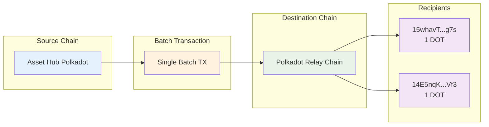

# Batch Teleport Assets

## Introduction

Cross-chain asset transfers are a fundamental feature of the Polkadot ecosystem, enabling seamless movement of tokens between different parachains. The [ParaSpell SDK](https://paraspell.github.io/docs/){target=\_blank} simplifies this process by providing powerful tools for executing both single and batch teleport operations.

This tutorial will guide you through creating batch teleport transactions using the [ParaSpell SDK](https://paraspell.github.io/docs/){target=\_blank}. You'll learn how to bundle multiple cross-chain transfers into a single transaction, making your operations more efficient and cost-effective. By the end, you'll be able to execute batch teleports between Polkadot Hub chains and understand the underlying mechanisms.

## Prerequisites

Before getting started, ensure you have the following:

- [Bun](https://bun.sh/){target=\_blank} v1.0 or later installed on your system
- A Polkadot wallet with sufficient test tokens for transaction fees
- Basic understanding of TypeScript/JavaScript
- General understanding of the [Polkadot protocol](/polkadot-protocol/parachain-basics/){target=\_blank}
- Some knowledge of [XCM (Cross-Consensus Messaging)](/develop/interoperability/intro-to-xcm/){target=\_blank}

## Project Overview

This tutorial demonstrates how to create batch teleport transactions that can transfer tokens from one parachain to multiple destinations on the Polkadot relay chain in a single operation. You'll work with:

- [Asset Hub](/polkadot-protocol/architecture/system-chains/asset-hub/){target=\_blank} as the source chain
- Multiple destination addresses
- DOT/PAS tokens as the transferred assets
- Batch transaction construction and execution

Below is a high-level overview of what you'll be building:



Your project directory will be organized as follows:

```bash
batch-teleport-tutorial
├── index.ts
├── package.json
└── README.md
```

## Set Up the Project

Create a new Bun project:

```bash
mkdir batch-teleport-tutorial
cd batch-teleport-tutorial
bun init -y
```

## Install Dependencies

Install the ParaSpell SDK:

```bash
bun add @paraspell/sdk@{{dependencies.javascript_packages.paraspell_sdk.version}}
```

## Create the Implementation

Create an `index.ts` file with the complete batch teleport implementation. For testing purposes, you will be using [Paseo Asset Hub](/develop/networks/#paseo){target=\_blank} (a Polkadot community-driven TestNet).

```typescript title="index.ts"
--8<-- 'code/tutorials/polkadot-sdk/system-chains/asset-hub/index.ts'
```

!!!note "Understanding Batch Modes"
    The ParaSpell SDK supports two batch modes:

    - BatchMode.BATCH_ALL
        - **Behavior**: All operations must succeed, or the entire batch fails
        - **Use Case**: When all transfers are critical and interdependent
        - **Gas Efficiency**: More efficient as it's a single atomic operation

    - BatchMode.BATCH
        - **Behavior**: Individual operations can fail independently
        - **Use Case**: When some transfers can fail without affecting others
        - **Resilience**: More resilient but with slightly higher gas overhead

Update your `package.json` to include the necessary scripts:

```json title="package.json"
{
  "name": "batch-teleport-tutorial",
  "version": "1.0.0",
  "description": "Tutorial for creating batch teleport transactions with ParaSpell SDK using Bun",
  "main": "index.ts",
  "type": "module",
  "scripts": {
    "start": "bun run index.ts",
    "dev": "bun run --watch index.ts" // --watch automatically restarts the script when files change
 },
  },
  "dependencies": {
    "@paraspell/sdk": "^{{dependencies.javascript_packages.paraspell_sdk.version}}"
  }
}
```

## Configure Destination Addresses

For testing purposes, you can also modify the destination addresses in the batch operations:

- `'15whavTNSyceP8SL3Z1JukFcUPzmeR26RxKXkfQiPhsykg7s'`
- `'14E5nqKAp3oAJcmzgZhUD2RcptBeUBScxKHgJKU4HPNcKVf3'`

## Run Your Batch Teleport

Execute the batch teleport from your project directory:

```bash
bun run dev
```

You should see output similar to:

--8<-- 'code/tutorials/polkadot-sdk/system-chains/asset-hub/papi-console-output.html'

The encoded data is formatted into a PAPI console link for easy submission through a web interface.

Make sure your Polkadot wallet is funded with some test tokens by using the [Polkadot faucet](https://faucet.polkadot.io/?parachain=1000){target=\_blank}  and submit the transaction.

## Submitting the Transaction

After running the script:

1. **Copy the generated link** from the console output
2. **Open the link** in your web browser
3. **Connect your wallet** (such as Polkadot.js extension)
4. **Review the transaction details** in the PAPI console
5. **Submit the transaction** and confirm with your wallet

    

The PAPI console will show:

- The encoded call data
- Transaction details and parameters
- Estimated fees
- Submission interface

## Dry Run your Transactions

It is best practice to conduct dry run tests before execution of a cross-chain transfer to prevent failures. XCM operations can trap or permanently lose assets if improperly constructed. The dry run functionality in this code helps identify potential issues before committing real assets to the cross-chain transfer.

??? code "Batch Teleport with Dry Run"

    ```typescript title="batch-teleport-with-dry-run.ts"
    --8<-- 'code/tutorials/polkadot-sdk/system-chains/asset-hub/batch-teleport-with-dry-run.ts'
    ```

## Conclusion

Congratulations! You've successfully implemented batch teleport functionality using the ParaSpell SDK. This single-file implementation demonstrates how to:

- Bundle multiple cross-chain transfers into efficient batch operations.
- Configure network settings for different environments.
- Generate ready-to-submit transaction data.
- Use the PAPI console for transaction submission.

The batch teleport feature significantly improves efficiency when performing multiple cross-chain transfers, reducing both time and transaction costs in the Polkadot ecosystem.

## Where to Go Next

<div class="grid cards" markdown>

-   <span class="badge guide">Guide</span> __Best Practices for Teleporting Assets__

    ---

    An in-depth guide on best practices for teleporting assets using XCM

    [:octicons-arrow-right-24: Best Practices for Teleporting Assets](/develop/interoperability/best-practices-for-teleporting-assets/){target=\_blank}

-   <span class="badge tutorial">ParaSpell SDK Docs</span> __ParaSpell SDK Deep Dive__

    ---

    Explore more advanced features of the ParaSpell SDK for cross-chain development.

    [:octicons-arrow-right-24: SDK Documentation](https://paraspell.github.io/docs/){target=\_blank}

</div>