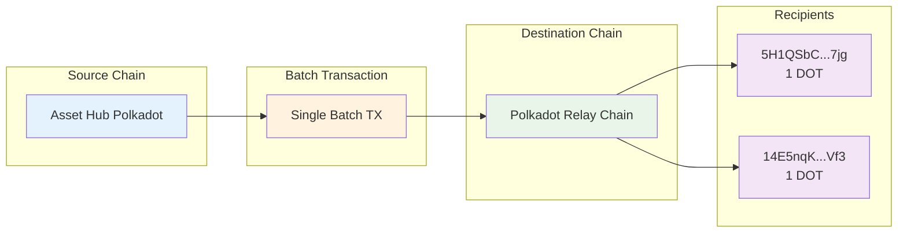

# Batch Teleport

Cross-chain asset transfers are a fundamental feature of the Polkadot ecosystem, enabling seamless movement of tokens between different parachains. The ParaSpell SDK simplifies this process by providing powerful tools for executing both single and batch teleport operations.

This tutorial will guide you through creating batch teleport transactions using the [ParaSpell SDK](https://paraspell.github.io/docs/){target=_blank}. You'll learn how to bundle multiple cross-chain transfers into a single transaction, making your operations more efficient and cost-effective. By the end, you'll be able to execute batch teleports between Polkadot Hub chains and understand the underlying mechanisms.

## Prerequisites

Before getting started, ensure you have the following:

- [Bun](https://bun.sh/){target=_blank} v1.0 or later installed on your system
- A Polkadot wallet with sufficient test tokens for transaction fees
- Basic understanding of TypeScript/JavaScript
- Familiarity with Polkadot ecosystem concepts (parachains, XCM, teleports)
- Some knowledge of [XCM (Cross-Consensus Messaging)](/develop/interoperability/intro-to-xcm/){target=_blank}

## Project Overview

This tutorial demonstrates how to create batch teleport transactions that can transfer tokens from one parachain to multiple destinations on the Polkadot relay chain in a single operation. You'll work with:

- Asset Hub as the source chain
- Multiple destination addresses
- DOT/WND tokens as the transferred assets
- Batch transaction construction and execution

Below is a high-level overview of what you'll be building:



Your project directory will be organized as follows:

```bash
batch-teleport-tutorial
├── index.ts
├── package.json
└── README.md
```

## Set Up the Project

Create a new Bun project:

```bash
mkdir batch-teleport-tutorial
cd batch-teleport-tutorial
bun init -y
```

## Install Dependencies

Install the ParaSpell SDK:

```bash
bun add @paraspell/sdk
```

## Create the Implementation

Create an `index.ts` file with the complete batch teleport implementation.
> For testing purposes, you will be using Westend (a Polkadot TestNet).

```typescript
import { Builder, Version, BatchMode } from '@paraspell/sdk';

// DOT has 10 decimals, we use this to simplify.
const DOT_UNITS = 10_000_000_000n;
// If using Westend, you should use these decimals.
const WND_UNITS = 1_000_000_000_000n;
// The RPC endpoints to connect to Westend.
// Not needed if using Polkadot.
const WESTEND_AH_RPC = 'wss://westend-asset-hub-rpc.polkadot.io';

teleport();

async function teleport() {
  const builder = Builder([WESTEND_AH_RPC])
    .from('AssetHubPolkadot')
    .to('Polkadot')
    .currency({ symbol: 'DOT', amount: 1n * WND_UNITS })
    .address('5H1QSbCJbCMAwbRp5uxJmbRTcn17x7TxMTb3bNRMqcrTa7jg')
    .xcmVersion(Version.V5)
    .addToBatch()

    .from('AssetHubPolkadot')
    .to('Polkadot')
    .currency({ symbol: 'DOT', amount: 1n * WND_UNITS })
    .address('14E5nqKAp3oAJcmzgZhUD2RcptBeUBScxKHgJKU4HPNcKVf3')
    .xcmVersion(Version.V5)
    .addToBatch();
  const tx = await builder.buildBatch({
    // This settings object is optional and batch all is the default option
    mode: BatchMode.BATCH_ALL //or BatchMode.BATCH
  })
  const callData = await tx.getEncodedData();

  // This generates a link the polkadot developer console.
  // Once there, it's easy to submit.
  console.log(`Send via PAPI console:
    https://dev.papi.how/extrinsics#networkId=westend_asset_hub&endpoint=light-client&data=${callData.asHex()}
  `);
}
```

Update your `package.json` to include the necessary scripts:

```json
{
  "name": "batch-teleport-tutorial",
  "version": "1.0.0",
  "description": "Tutorial for creating batch teleport transactions with ParaSpell SDK using Bun",
  "main": "index.ts",
  "type": "module",
  "scripts": {
    "start": "bun run index.ts",
    "dev": "bun run index.ts"
  },
  "dependencies": {
    "@paraspell/sdk": "^10.10.5"
  }
}
```

## Configure Destination Addresses

For testing purposes, you can also modify the destination addresses in the batch operations:
- `'5H1QSbCJbCMAwbRp5uxJmbRTcn17x7TxMTb3bNRMqcrTa7jg'`
- `'14E5nqKAp3oAJcmzgZhUD2RcptBeUBScxKHgJKU4HPNcKVf3'`

## Run Your Batch Teleport

Execute the batch teleport from your project directory:

```bash
bun run dev
```

You should see output similar to:

```
Send via PAPI console:
    https://dev.papi.how/extrinsics#networkId=westend_asset_hub&endpoint=light-client&data=0x1c041c...
```

## How It Works

Let's examine the key components of this batch teleport implementation:

### 1. **Network Configuration**
```typescript
const WESTEND_AH_RPC = 'wss://westend-asset-hub-rpc.polkadot.io';
```
The RPC endpoint connects to the Westend Asset Hub, which serves as our source chain for the batch operations.

### 2. **Token Decimals**
```typescript
const DOT_UNITS = 10_000_000_000n;
const WND_UNITS = 1_000_000_000_000n;
```
Different networks use different decimal precision:
- DOT uses 10 decimals on Polkadot
- WND uses 12 decimals on Westend

### 3. **Builder Pattern Chain**
```typescript
const builder = Builder([WESTEND_AH_RPC])
  .from('AssetHubPolkadot')
  .to('Polkadot')
  .currency({ symbol: 'DOT', amount: 1n * WND_UNITS })
  .address('5H1QSbCJbCMAwbRp5uxJmbRTcn17x7TxMTb3bNRMqcrTa7jg')
  .xcmVersion(Version.V5)
  .addToBatch()
```

Each chain in the builder:
- **`.from()`**: Specifies the source parachain
- **`.to()`**: Specifies the destination parachain
- **`.currency()`**: Defines the token and amount to transfer
- **`.address()`**: Sets the recipient address
- **`.xcmVersion()`**: Uses XCM Version 5 for the transfer
- **`.addToBatch()`**: Adds this operation to the batch queue

### 4. **Batch Construction**
```typescript
const tx = await builder.buildBatch({
  mode: BatchMode.BATCH_ALL
});
```

The batch is built with `BatchMode.BATCH_ALL`, meaning all operations must succeed or the entire batch fails.

### 5. **Transaction Encoding**
```typescript
const callData = await tx.getEncodedData();
```

The transaction is encoded into call data that can be submitted to the blockchain.

### 6. **Console Integration**
```typescript
console.log(`Send via PAPI console:
  https://dev.papi.how/extrinsics#networkId=westend_asset_hub&endpoint=light-client&data=${callData.asHex()}
`);
```

The encoded data is formatted into a PAPI console link for easy submission through a web interface.


Make sure your Polkadot wallet is funded with some test tokens by using the [Polkadot faucet](https://faucet.polkadot.io/westend) and submit the transaction.

## Understanding Batch Modes

The ParaSpell SDK supports two batch modes:

### BatchMode.BATCH_ALL
- **Behavior**: All operations must succeed, or the entire batch fails
- **Use Case**: When all transfers are critical and interdependent
- **Gas Efficiency**: More efficient as it's a single atomic operation

### BatchMode.BATCH
- **Behavior**: Individual operations can fail independently
- **Use Case**: When some transfers can fail without affecting others
- **Resilience**: More resilient but with slightly higher gas overhead

## Submitting the Transaction

After running the script:

1. **Copy the generated link** from the console output
2. **Open the link** in your web browser
3. **Connect your wallet** (such as Polkadot.js extension)
4. **Review the transaction details** in the PAPI console
5. **Submit the transaction** and confirm with your wallet

The PAPI console will show:

- The encoded call data
- Transaction details and parameters
- Estimated fees
- Submission interface

## Network Considerations

### Testnet vs Mainnet
The example uses Westend testnet configuration:

- Uses `WESTEND_AH_RPC` endpoint
- Transfers use `WND_UNITS` (12 decimals)
- Safe for testing without real value

For mainnet operations:

- Remove the RPC endpoint parameter: `Builder([])`
- Use `DOT_UNITS` for proper decimal handling
- Ensure sufficient balance for real transfers

### XCM Version
The code uses `Version.V5`, which is the latest XCM version offering:

- Improved error handling
- Enhanced fee management
- Better cross-chain communication reliability

## Common Use Cases

This batch teleport pattern is useful for:

### 1. **Multi-recipient Airdrops**
Send tokens to multiple addresses in a single transaction:

```typescript
// Each .addToBatch() creates a separate transfer
.address('recipient1').addToBatch()
.address('recipient2').addToBatch()
.address('recipient3').addToBatch()
```

### 2. **Portfolio Rebalancing**
Move assets across multiple parachains efficiently:

```typescript
// Different destination chains in the same batch
.to('Polkadot').addToBatch()
.to('Acala').addToBatch()
.to('Moonbeam').addToBatch()
```

### 3. **Cost Optimization**
Reduce transaction fees by batching multiple operations that would otherwise require separate transactions.

## Error Handling

If the batch fails, common issues include:

- **Insufficient balance** on the source chain
- **Invalid addresses** in the destination fields
- **Network connectivity** issues with RPC endpoints
- **XCM execution failures** on the destination chain

Check the console output and blockchain explorer for detailed error messages.

## Conclusion

Congratulations! You've successfully implemented batch teleport functionality using the ParaSpell SDK. This single-file implementation demonstrates how to:

- Bundle multiple cross-chain transfers into efficient batch operations
- Configure network settings for different environments
- Generate ready-to-submit transaction data
- Use the PAPI console for transaction submission

The batch teleport feature significantly improves efficiency when performing multiple cross-chain transfers, reducing both time and transaction costs in the Polkadot ecosystem.

## Where to Go Next

<div class="grid cards" markdown>

-   <span class="badge guide">Guide</span> __Best Practices for Teleporting Assets__

    ---

    An in-depth guide on best practices for teleporting assets using XCM

    [:octicons-arrow-right-24: Best Practices for Teleporting Assets](develop/interoperability/best-practices-for-teleporting-assets/)

-   <span class="badge tutorial">Tutorial</span> __ParaSpell SDK Deep Dive__

    ---

    Explore more advanced features of the ParaSpell SDK for cross-chain development.

    [:octicons-arrow-right-24: SDK Documentation](https://paraspell.github.io/docs/)

</div>