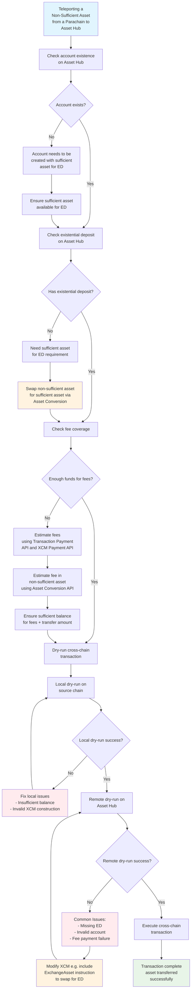

# Handling Sufficient and Non-Sufficient Assets

## Introduction

[Sufficient assets](https://wiki.polkadot.network/learn/learn-assets/#sufficient-assets) are assets that have been voted upon and approved by governance that can suffice for account existence. This means that sufficient assets can be used for an account's [existential deposit](https://wiki.polkadot.network/learn/learn-accounts/#existential-deposit-and-reaping) on Asset Hub. 

Non-sufficient assets, on the other hand, **cannot** suffice on their own for account existence. Non-sufficient assets rely on a sufficient asset for the existential deposit. However, through the use of [asset conversion](https://wiki.polkadot.network/learn/learn-asset-conversion-assethub/), non-sufficient assets can be treated as first-class citizens on Asset Hub with similar functionality to sufficient assets, creating a seamless experience for end users.

On Asset Hub, sufficient assets:

- Can be used for existential deposit (ED)
  - This is what makes it unique from non-sufficient assets
- Can be used for paying transaction fees
  - The system natively converts the DOT amount required to an asset balance and the signer actually pays that asset to a collator.
- Can be used for paying XCM fees
- Cannot be used for deposits e.g. storage deposits

[Asset conversion](https://wiki.polkadot.network/learn/learn-asset-conversion-assethub) provides an abstraction layer and mechanism that can convert any asset regardless of asset type (sufficient or non-sufficient) to the parachain's native asset which in turn allows for the following:

- Pay transaction fees and XCM fees in any asset; including with non-sufficient assets
  - Assets that have [pools set up](https://wiki.polkadot.network/learn/learn-guides-asset-conversion/#create-a-liquidity-pool) against the native asset (e.g. DOT) and also have healthy liquidity in them so as not to get burned on swaps.
    - e.g. ABC parachain has ABC/DOT asset pool on Asset Hub
- The ability to swap a non-sufficient asset for a sufficient asset to pay for the existential deposit

## Transaction Fees

On Asset Hub, both sufficient and non-sufficient assets can be used for paying transaction fees. For sufficient assets, Asset Hub natively converts the native asset (e.g. DOT) amount required to an asset balance and the signer actually pays that asset to a collator. Non-sufficient assets on Asset Hub leverage [asset conversion](https://wiki.polkadot.network/learn/learn-asset-conversion-assethub) by exchanging the non-sufficient asset for the native asset. For this to work, non-sufficient assets need to have a [liquidity pool set up](https://wiki.polkadot.network/learn/learn-guides-asset-conversion/#create-a-liquidity-pool) against the native asset (e.g. DOT).

[Asset conversion](https://wiki.polkadot.network/learn/learn-asset-conversion-assethub) provides an abstraction layer and mechanism that can convert any asset to the underlying native asset (e.g. DOT).

**Note**: UI's, wallets, and tools may have limitations because of design decisions and/or contraints it places e.g. only allowing to pay transaction fees in the native token (e.g. DOT) when in reality the underlying protocol supports payment of transaction fees in any asset via sufficient assets and/or the use of asset conversion.

## XCM Fees

Both sufficient assets and non-sufficient assets can be used to pay for XCM fees on Asset Hub. However, it is important to note that the XCM program needs to explicitly reference the asset to pay the XCM fee in.

**Note**: UI's, wallets, and tools may have limitations because of design decisions and/or contraints it places e.g. constructing the XCM call in a specific manner and therefore limiting the end user when in reality Asset Hub encompasses more functionality such as the ability to pay transaction fees and XCM fees in any asset.

## Parachain Compatibility

It is important to note that the functionality covered on this page is configured for Asset Hub. Depending on the use case, the destination parachain or sending parachain may also need to be configured in a similar manner (e.g. supporting sufficient assets, support ED in any sufficient asset, paying fees in any sufficient asset, swapping a non-sufficient asset for a native asset) to allow for the features covered on this page to also exist on that chain.

When it comes to parachains interacting with Asset Hub, it means they can use Asset Hub's native asset (e.g. DOT), their parachain's native asset (e.g. ABC), or the user’s asset (e.g. USDT/C) for fee payment and not expose more complexity to the user. When it comes to two parachains (not Asset Hub) interacting, the two parachains need to agree on some fee asset that is compatible on both chains.

If you are sending an asset from Asset Hub to a Polkadot parachain then the destination parachain needs to have Asset Hub configured as a reserve chain to allow for a teleport from Asset Hub to the parachain without an intermediary step. Always refer to the parachain's documentation and dry run your cross-chain transactions before executing with live funds.

## Teleporting an Asset from a Parachain to Asset Hub

When teleporting an asset from a parachain to Asset Hub there are a few things to consider to make sure the cross-chain transaction is set up for success.

1. [Check for account existence on the destination chain](#check-for-account-existence-and-existential-deposit)
2. [Check that the account has an existential deposit (ED)](#check-for-account-existence-and-existential-deposit)
3. [Make sure the account has enough funds to cover transaction fees and XCM fees](#make-sure-the-account-has-enough-funds-to-cover-for-fees)
4. For sufficient assets, depending on the operation, [make sure the sufficient asset is compatible on both chains](#parachain-compatibility)
5. For non-sufficient assets, depending on the operation, [make sure that the XCM has an instruction to swap for a native or sufficient asset](#dry-run-a-cross-chain-transaction)
6. Above all, always [dry-run the cross-chain transaction](#dry-run-a-cross-chain-transaction)

### Teleporting a Non-Sufficient Asset from a Parachain to Asset Hub


### Check for Account Existence and Existential Deposit

Making sure that an account exists on Asset Hub and that it has an existential deposit before sending assets to it can be done with a simple check. Here is an example PolkadotJS snippet that checks if an account exists on Polkadot and if it has an existential deposit.

```javascript title="check-account-existence.js"
--8<-- 'code/tutorials/polkadot-sdk/system-chains/asset-hub/check-account-existence.js:0:87'
```

### Make Sure the Account Has Enough Funds to Cover Fees

If that account will be paying fees then you will also want to make sure it has enough funds to cover for those fees. You can obtain an estimate of the transaction fees by using the [Transaction Payment API](https://paritytech.github.io/polkadot-sdk/master/pallet_transaction_payment/pallet/struct.Pallet.html#method.query_fee_details) and XCM fees by using the [XCM Payment API](https://paritytech.github.io/polkadot-sdk/master/xcm_runtime_apis/fees/trait.XcmPaymentApi.html#method.query_delivery_fees). You can then estimate the fee in the non-sufficient asset by using the [Asset Conversion Runtime API](https://paritytech.github.io/polkadot-sdk/master/pallet_asset_conversion/trait.AssetConversionApi.html#method.quote_price_exact_tokens_for_tokens).

And finally, you will want to dry run the transaction.

### Dry Run a Cross-Chain Transaction

```typescript title="teleport-non-sufficient.ts"
--8<-- 'code/tutorials/polkadot-sdk/system-chains/asset-hub/teleport-non-sufficient.ts:0:180'
```

The above snippet is an example of teleporting MYTH from the Mythos parachain to Asset Hub. Instead of just submitting a `limited_teleport_assets` call, the code does a dry run first.

First you need to create the transaction that will do the cross-chain transfer. You want to dry run it locally to know that it'll work when executed on the source chain, Mythos.

If the local dry-run is successful, you get the message that will be sent to Asset Hub. You can then dry-run this message on Asset Hub to see if it's successful.

If the remote dry-run fails, it might be because of different reasons. It may be because the Existential Deposit (ED) was not met, so you can change the XCM to include an explicit swap of MYTH to enough DOT to cover the ED. After this, you dry-run again to check if it works.

The teleport dry-run example above uses Polkadot API (PAPI) but PJS/Dedot would be similar.

#### Dry Run API

Dry running a cross-chain transaction prevents situations where assets can become trapped and/or dropped due to a mal-constructed XCM transaction as opposed to local transactions where the transaction will simply fail. Dry running a transaction is possible with the `DryRunAPI`.

The `DryRunApi` is a runtime API that is integrated in all the system parachains as well as some of the most popular parachains.

This API can be used to dry-run any call and find out if it's successful or not. It especially shines when used with XCM.

When you dry-run a call that executes an XCM, like `limited_teleport_assets`, with `DryRunApi::dry_run_call`, then you'll receive an object called `DryRunCallEffects` listing a couple of effects resulting from the execution:

- Result
- Events
- Local XCM
- Forwarded XCMs

This dry run result tells you if the operation is successful or not.

You can dry run any cross-chain transfer locally as well as remotely.

It's crucial to also dry run the remote XCM so you are sure the cross-chain transfer will work when it reaches the other chain.

## Teleporting an Asset from Asset Hub to a Parachain

**Scenario**

1. A user wants to send a sufficient asset (USDC) from Asset Hub to a Parachain.
2. The user doesn't have DOT to pay the transaction fee.
3. The user wants to pay the transaction fee with the asset they're sending.
4. The asset can be swapped for DOT on Asset Hub to cover the fee.


```typescript title="teleport-sufficient.js"
--8<-- 'code/tutorials/polkadot-sdk/system-chains/asset-hub/teleport-sufficient.js:0:94'
```

Source: https://github.com/lrazovic/xcm-batch-example/blob/main/index.ts

Demo transaction: https://assethub-polkadot.subscan.io/extrinsic/6657108-3

## UIs, Wallets, and Tools Interacting with Asset Hub

When developing cross-chain applications to interact with Asset Hub it is important to consider the UI/UX and the trade-offs it may have. 

For example, if you want to send 100 USDT to a new Asset Hub account, does the amount swapped for existential deposit (ED) get debited from the sending amount (e.g. receiver gets 0.01 DOT and 99.95 USDT) or does the sender pay a little more (e.g. receiver gets the full 100 USDT) to cover for the ED, transaction fees, and any associated XCM fees.

Depending on the design decision made, the underlying XCM and transaction will be crafted differently.
