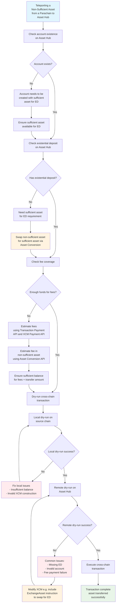

# Teleport an Asset to Asset Hub

## Prerequisites

Before you begin, make sure you have the following:

- Strong knowledge of [XCM (Cross-Consensus Messaging)](/develop/interoperability/intro-to-xcm/)
- Firm understanding of [sufficient and non-sufficient assets](/polkadot-protocol/architecture/system-chains/asset-hub/#sufficient-and-non-sufficient-assets)

## Introduction

When teleporting an asset from a parachain to Asset Hub there are a few things to consider to make sure the cross-chain transaction is set up for success.

1. [Check for account existence on the destination chain (Asset Hub)](#check-for-account-existence-and-existential-deposit)
2. [Check that the account has an existential deposit (ED)](#check-for-account-existence-and-existential-deposit)
3. [Make sure the account has enough funds to cover for transaction fees and XCM fees](#make-sure-the-account-has-enough-funds-to-cover-for-fees)
4. For [sufficient assets](https://wiki.polkadot.network/learn/learn-assets/#sufficient-assets), depending on the operation, [make sure the sufficient asset is compatible on both chains](#parachain-compatibility)
5. For [non-sufficient assets](http://localhost:8000/polkadot-protocol/architecture/system-chains/asset-hub/#sufficient-and-non-sufficient-assets), depending on the operation, [make sure that the XCM has an instruction to swap for a native or sufficient asset](#dry-run-a-cross-chain-transaction)
6. Above all, always [dry-run the cross-chain transaction](#dry-run-a-cross-chain-transaction)

### Teleporting a Non-Sufficient Asset from a Parachain to Asset Hub


### Check for Account Existence and Existential Deposit

Making sure that an account exists on Asset Hub and that it has an existential deposit before sending assets to it can be done with a simple check. Here is an example PolkadotJS snippet that checks if an account exists on Polkadot and if it has an existential deposit.

```javascript title="check-account-existence.js"
--8<-- 'code/tutorials/polkadot-sdk/system-chains/asset-hub/check-account-existence.js:0:87'
```

### Make Sure the Account Has Enough Funds to Cover Fees

If that account will be paying fees then you will also want to make sure it has enough funds to cover for those fees. You can obtain an estimate of the transaction fees by using the [Transaction Payment API](https://paritytech.github.io/polkadot-sdk/master/pallet_transaction_payment/pallet/struct.Pallet.html#method.query_fee_details) and an estimate on XCM fees by using the [XCM Payment API](https://paritytech.github.io/polkadot-sdk/master/xcm_runtime_apis/fees/trait.XcmPaymentApi.html#method.query_delivery_fees). You can then estimate the fee in the non-sufficient asset by using the [Asset Conversion Runtime API](https://paritytech.github.io/polkadot-sdk/master/pallet_asset_conversion/trait.AssetConversionApi.html#method.quote_price_exact_tokens_for_tokens).

And finally, you will want to dry run the transaction.

### Dry Run a Cross-Chain Transaction

```typescript title="teleport-non-sufficient.ts"
--8<-- 'code/tutorials/polkadot-sdk/system-chains/asset-hub/teleport-non-sufficient.ts:0:180'
```

The above snippet is an example of teleporting MYTH from the Mythos parachain to Asset Hub. Instead of just submitting a `limited_teleport_assets` call, the code does a dry run first.

First you need to create the transaction that will do the cross-chain transfer. You want to dry run it locally to know that it'll work when executed on the source chain, Mythos.

If the local dry-run is successful, you get the message that will be sent to Asset Hub. You can then dry-run this message on Asset Hub to see if it's successful.

If the remote dry-run fails, it might be because of different reasons. It may be because the Existential Deposit (ED) was not met, so you can change the XCM to include an explicit swap of MYTH to enough DOT to cover the ED. After this, you dry-run again to check if it works.

The teleport dry-run example above uses Polkadot API (PAPI) but PJS/Dedot would be similar.

#### Dry Run API

Dry running a cross-chain transaction prevents situations where assets can become trapped and/or dropped due to a mal-constructed XCM transaction as opposed to local transactions where the transaction will simply fail. Dry running a transaction is possible with the `DryRunAPI`.

The `DryRunApi` is a runtime API that is integrated in all the system parachains as well as some of the most popular parachains.

This API can be used to dry-run any call and find out if it's successful or not. It especially shines when used with XCM.

When you dry-run a call that executes an XCM, like `limited_teleport_assets`, with `DryRunApi::dry_run_call`, then you'll receive an object called `DryRunCallEffects` listing a couple of effects resulting from the execution:

- Result
- Events
- Local XCM
- Forwarded XCMs

This dry run result tells you if the operation is successful or not.

You can dry run any cross-chain transfer locally as well as remotely.

It's crucial to also dry run the remote XCM so you are sure the cross-chain transfer will work when it reaches the other chain.

