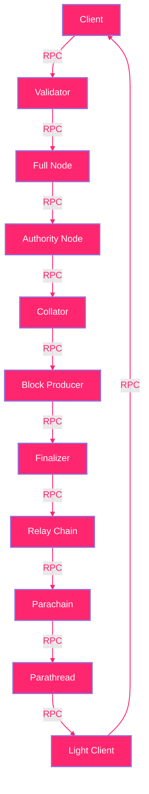
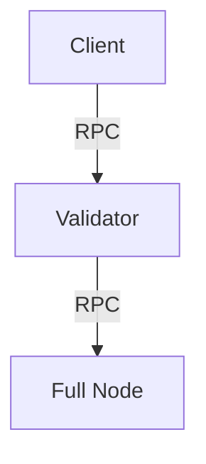
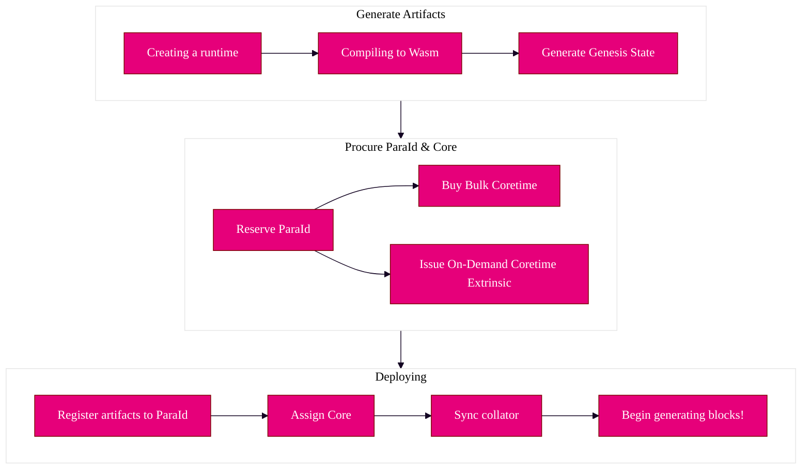

# Mermaid Test

This is a test of the Mermaid diagramming tool. Polkadot Architecture:

```mermaid
%%{
  init: {
    'themeVariables': {
      'lineColor': '#FF2670'
    }
  }
}%%
graph TD;
  A[Client] -->|RPC| B[Validator];
  B -->|RPC| C[Full Node];
  C -->|RPC| D[Authority Node];
  D -->|RPC| E[Collator];
  E -->|RPC| F[Block Producer];
  F -->|RPC| G[Finalizer];
  G -->|RPC| H[Relay Chain];
  H -->|RPC| I[Parachain];
  I -->|RPC| J[Parathread];
  J -->|RPC| K[Light Client];
  K -->|RPC| A;

classDef default fill:#FF2670,stroke-width:2px,color:#fff;
classDef active fill:#FF2670,stroke-width:2px,color:#fff;
class A,B,C,D,E,F,G,H,I,J,K default;

linkStyle default stroke:#FF2670,stroke-width:1.5px,color:#FF2670,fill:none !important;

```

```mermaid
%%{
    init: {
        'themeCSS': '
            .arrowheadPath { fill: #FF2670 !important; };
        '
    }
}%%

flowchart TD
    A[Client] -->|RPC| B[Validator];
    B -->|RPC| C[Full Node];

```

```mermaid
%%{
 init: {
 'theme': 'base',
 'themeVariables': {
 'fontFamily': 'Unbounded',
 'primaryColor': '#E6007A',
 'fontSize': '16px',
 'primaryTextColor': '#fff',
 'primaryBorderColor': '#7C0000',
 'lineColor': '#140523',
 'secondaryColor': '#552BBF',
 'tertiaryColor': '#fff'
 }
 }
}%%
flowchart TD
    subgraph GA["Generate Artifacts"]
        direction LR
        A["Creating a runtime"]-->B["Compiling to Wasm"]-->C["Generate Genesis State"]
    end

    subgraph PC["Procure ParaId & Core"]
        direction LR
        PARAID["Reserve ParaId"]
        PARAID-->D["Buy Bulk Coretime"]
        PARAID-->E["Issue On-Demand Coretime Extrinsic"]
    end


    subgraph DEP["Deploying"]
        direction LR
        F["Register artifacts to ParaId"]-->assign["Assign Core"]-->G["Sync collator"]-->H["Begin generating blocks!"]
    end

GA-->PC
PC-->DEP
```